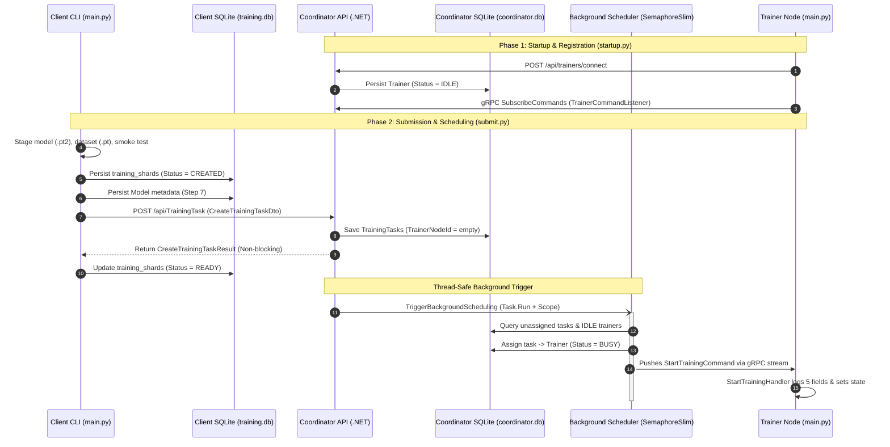

# Task Assignment Verification Sample

This sample directory provides an automated, non-dockerized, end-to-end verification test harness for the complete TrainSwarm training submission, thread-safe background task scheduling, gRPC command dispatch, and trainer ingestion flow.

---

## Architecture Overview



---

## File Structure

```text
samples/task_assignment_test/
├── startup.py       # Spawns Coordinator & Trainer, records PIDs, generates .pt2, .pt, config.json
├── submit.py        # Runs Client CLI submit-training, queries SQLite DBs, asserts logs
├── clean.py         # Kills background processes (.test_pids.txt), cleans DBs & artifacts
└── README.md        # Architecture, walkthrough, and execution instructions
```

---

## Prerequisites

1. **.NET SDK**: .NET 10 SDK installed (`dotnet --version`).
2. **Python**: Python 3.10+ installed with PyTorch (`torch>=2.2.0`).
3. **Local Network Ports**: Port `5050` available on `127.0.0.1`.

---

## Step-by-Step Execution

### Step 1: Start Background Services & Synthesize Test Artifacts

Run `startup.py`:

```powershell
python samples/task_assignment_test/startup.py
```

**Actions Performed**:
1. Verifies `dotnet` and `python` runtimes.
2. Cleans any prior test state, kills old PIDs, and releases port 5050.
3. Launches the **Coordinator** Web API as a detached background process on port `5050` with SQLite storage at `db/coordinator.db` and output redirected to `coordinator.log`.
4. Polls `http://127.0.0.1:5050/health` until `HTTP 200 OK`.
5. Launches the **Trainer** node via `python src/Trainer/main.py` pointing to `127.0.0.1:5050` with output redirected to `trainer.log`.
6. Trainer automatically triggers its startup connection guard (`run_startup()`), registering with Coordinator and starting its gRPC `TrainerCommandListener`.
7. Asserts Trainer registration in `db/coordinator.db` with `Status = 1` (`IDLE`).
8. Generates synthetic PyTorch 2 model checkpoint (`test_model.pt2`), tiny dataset (`test_dataset.pt`), and `training_config.json` in `artifacts/`.
9. Records background PIDs into `.test_pids.txt` and exits `0`, leaving services running for submission testing.

---

### Step 2: Submit Training & Run End-to-End Assertions

In the same terminal, run `submit.py`:

```powershell
python samples/task_assignment_test/submit.py
```

**Verifications & Assertions Performed**:
1. Checks Coordinator `/health` and existence of generated artifacts.
2. Runs the Client CLI `submit-training` command with `--model-path`, `--dataset-path`, `--model-version v1.0`, and `--training-config`.
3. **Client SQLite Assertion**:
   - Queries `db/training.db` table `models`: verifies 1 record exists with `model_version = 'v1.0'`, non-empty `model_id`, `dataset_id`, and validates that staged artifact paths exist on disk.
   - Queries table `training_shards`: verifies shards are updated to status `READY`.
4. **Coordinator SQLite Assertion**:
   - Polls `db/coordinator.db` table `TrainingTasks`: verifies tasks were saved and the thread-safe background scheduler assigned `TrainerNodeId = 'trainer-node-01'`.
   - Verifies Trainer status in `Trainers` table is updated to `2` (`BUSY`).
5. **Trainer Log Assertion**:
   - Inspects `trainer.log` to confirm receipt of `StartTrainingCommand` with all 5 required fields:
     - `ClientNodeId`
     - `ModelId`
     - `ModelVersion`
     - `DataSetId`
     - `ShardId`
6. Prints the success summary banner and exits `0`.

---

### Step 3: Teardown & Environment Cleanup

Run `clean.py`:

```powershell
python samples/task_assignment_test/clean.py
```

To preserve generated test artifacts for debugging, pass `--keep-artifacts`:

```powershell
python samples/task_assignment_test/clean.py --keep-artifacts
```

**Actions Performed**:
1. Reads `.test_pids.txt` and terminates Coordinator and Trainer process trees.
2. Removes `.test_pids.txt`.
3. Frees port `5050` if still bound.
4. Removes temporary directories (`db/`, `client_work/`, and optionally `artifacts/`).
5. Removes `coordinator.log` and `trainer.log`.
