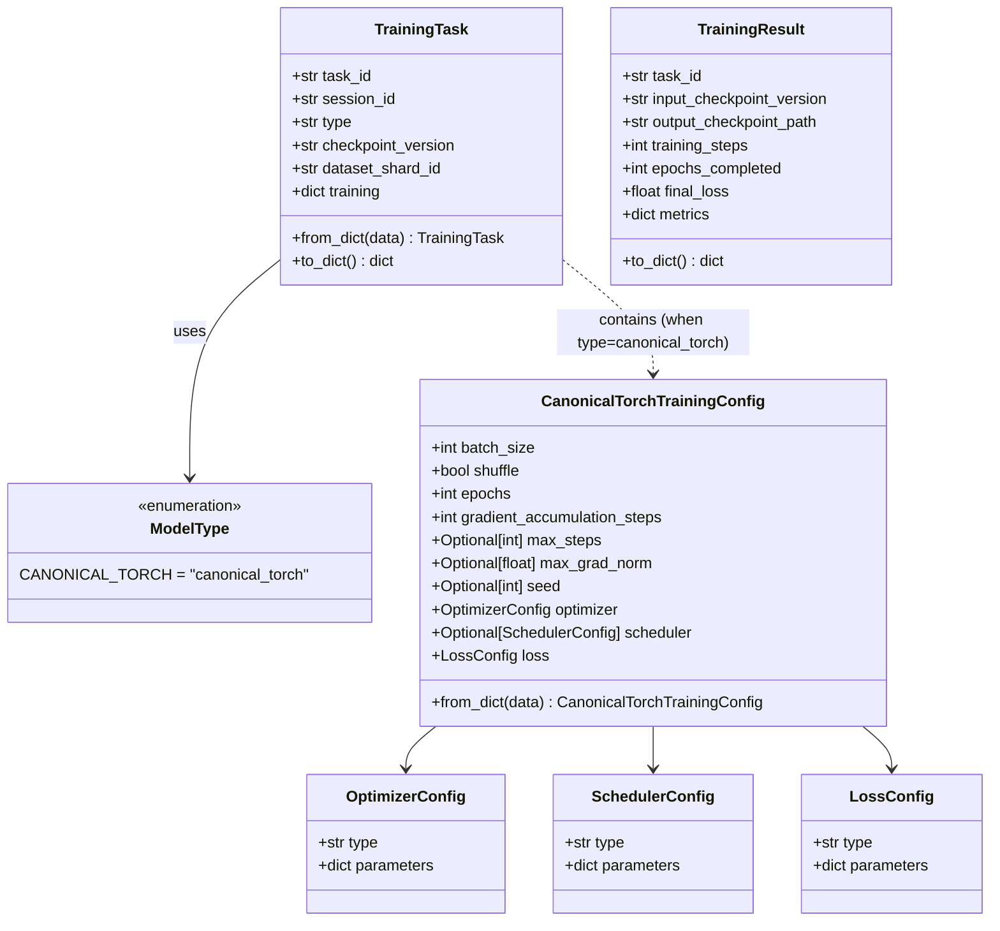
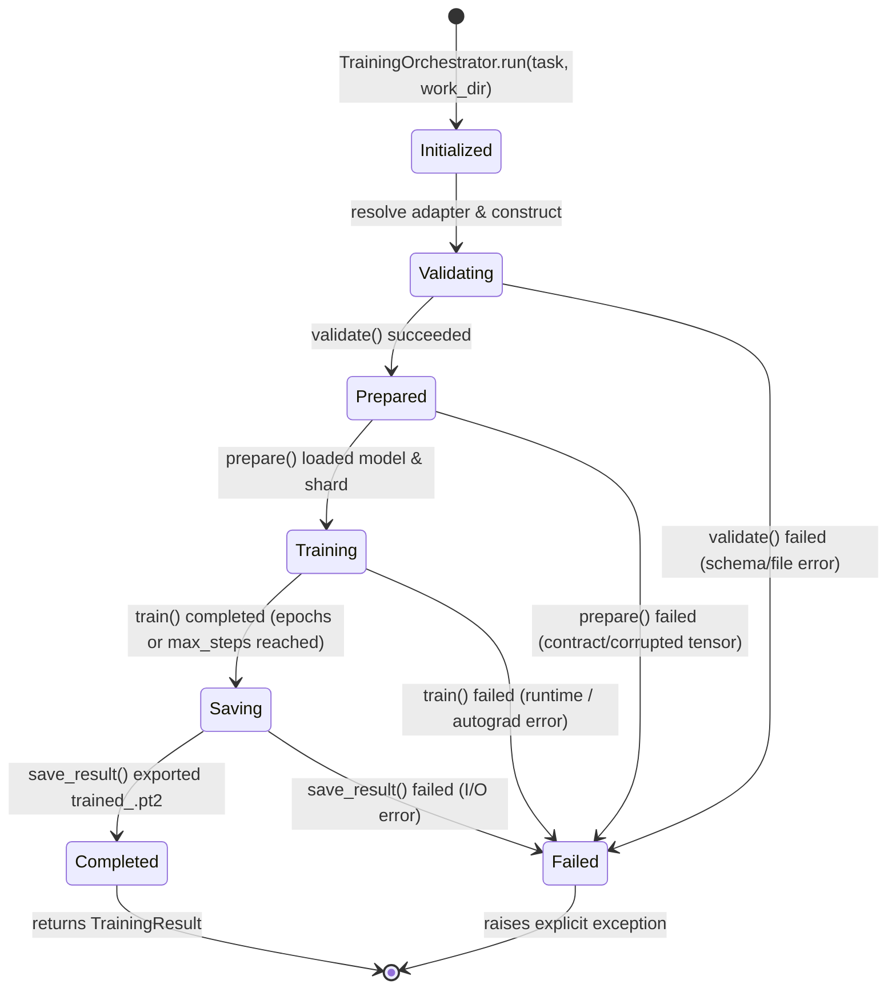

# Data Model: Distributed Training Engine

**Feature**: [Distributed Training Engine](spec.md)
**Status**: Draft
**Date**: 2026-08-30

## 1. Domain Entities & DTO Hierarchy

---

## 2. DTO Specifications

### 2.1 `TrainingTask`
Represents the serialized dispatch payload passed to `TrainingOrchestrator`.

| Field | Type | Required | Description | Validation |
| :--- | :--- | :--- | :--- | :--- |
| `task_id` | `str` | Yes | Unique identifier of the local training task | Non-empty string |
| `session_id` | `str` | Yes | Unique identifier of the global training session | Non-empty string |
| `type` | `str` / `ModelType` | Yes | Discriminator for the training adapter type | Must match registered `ModelType` |
| `checkpoint_version` | `str` | Yes | Starting global checkpoint version (resolves to `<checkpoint_version>.pt2`) | Non-empty string |
| `dataset_shard_id` | `str` | Yes | Shard identifier (resolves to `<dataset_shard_id>.pt`) | Non-empty string |
| `training` | `dict` | Yes | Polymorphic training-type specific configuration | Non-empty dictionary |

### 2.2 `CanonicalTorchTrainingConfig`
Strongly typed configuration deserialized by `CanonicalTorchAdapter`.

| Field | Type | Required | Description | Validation |
| :--- | :--- | :--- | :--- | :--- |
| `batch_size` | `int` | Yes | Number of samples per batch in DataLoader | `batch_size > 0` |
| `shuffle` | `bool` | Yes | Whether DataLoader shuffles dataset per epoch | Boolean |
| `epochs` | `int` | Yes | Number of complete passes over the dataset | `epochs > 0` |
| `gradient_accumulation_steps` | `int` | Yes | Number of batches contributing to one optimizer step | `gradient_accumulation_steps >= 1` |
| `max_steps` | `Optional[int]` | No | Maximum optimizer steps before terminating | Null or `max_steps > 0` |
| `max_grad_norm` | `Optional[float]`| No | Threshold for gradient norm clipping | Null or `max_grad_norm > 0.0` |
| `seed` | `Optional[int]` | No | Random seed for reproducibility | Null or integer |
| `optimizer` | `OptimizerConfig` | Yes | Optimizer type and parameters | Validated via `OptimizerRegistry` |
| `scheduler` | `Optional[SchedulerConfig]` | No | LR scheduler type and parameters | Validated via `SchedulerRegistry` |
| `loss` | `LossConfig` | Yes | Criterion loss type and parameters | Validated via `CriterionRegistry` |

### 2.3 Optimizer Parameter Models

| DTO Class | Optimizer Type | Parameters & Types | Default Values | Validation Rules |
| :--- | :--- | :--- | :--- | :--- |
| `AdamWParameters` | `AdamW` | `learning_rate: float`, `betas: Tuple[float, float]`, `eps: float`, `weight_decay: float`, `amsgrad: bool` | `betas=(0.9, 0.999)`, `eps=1e-8`, `weight_decay=0.01`, `amsgrad=False` | `learning_rate > 0.0`, `0 <= beta1 < 1`, `0 <= beta2 < 1`, `eps > 0`, `weight_decay >= 0` |
| `SGDParameters` | `SGD` | `learning_rate: float`, `momentum: float`, `dampening: float`, `weight_decay: float`, `nesterov: bool` | `momentum=0.0`, `dampening=0.0`, `weight_decay=0.0`, `nesterov=False` | `learning_rate > 0.0`, `momentum >= 0.0`, `weight_decay >= 0.0` |

### 2.4 Scheduler Parameter Models

| DTO Class | Scheduler Type | Parameters & Types | Default Values | Validation Rules |
| :--- | :--- | :--- | :--- | :--- |
| `ConstantLRParameters` | `ConstantLR` | `factor: float`, `total_iters: int` | `factor=1.0/3`, `total_iters=5` | `factor > 0`, `total_iters >= 1` |
| `LinearLRParameters` | `LinearLR` | `start_factor: float`, `end_factor: float`, `total_iters: int` | `start_factor=1.0/3`, `end_factor=1.0`, `total_iters=5` | `start_factor > 0`, `end_factor > 0`, `total_iters >= 1` |
| `StepLRParameters` | `StepLR` | `step_size: int`, `gamma: float` | `step_size=30`, `gamma=0.1` | `step_size >= 1`, `0 < gamma <= 1.0` |
| `ExponentialLRParameters` | `ExponentialLR` | `gamma: float` | `gamma=0.9` | `0 < gamma <= 1.0` |
| `CosineAnnealingLRParameters` | `CosineAnnealingLR` | `T_max: int`, `eta_min: float` | `T_max=10`, `eta_min=0.0` | `T_max >= 1`, `eta_min >= 0.0` |

### 2.5 Criterion Parameter Models

| DTO Class | Criterion Type | Parameters & Types | Default Values | Validation Rules |
| :--- | :--- | :--- | :--- | :--- |
| `MSELossParameters` | `MSELoss` | `reduction: str` | `reduction="mean"` | `reduction in ["mean", "sum", "none"]` |
| `L1LossParameters` | `L1Loss` | `reduction: str` | `reduction="mean"` | `reduction in ["mean", "sum", "none"]` |
| `SmoothL1LossParameters` | `SmoothL1Loss` | `beta: float`, `reduction: str` | `beta=1.0`, `reduction="mean"` | `beta >= 0`, `reduction in ["mean", "sum", "none"]` |
| `CrossEntropyLossParameters`| `CrossEntropyLoss`| `reduction: str`, `label_smoothing: float` | `reduction="mean"`, `label_smoothing=0.0` | `0.0 <= label_smoothing <= 1.0`, `reduction in ["mean", "sum", "none"]` |
| `BCEWithLogitsLossParameters`| `BCEWithLogitsLoss`| `reduction: str` | `reduction="mean"` | `reduction in ["mean", "sum", "none"]` |

### 2.6 `TrainingResult`

| Field | Type | Description |
| :--- | :--- | :--- |
| `task_id` | `str` | The task identifier executed |
| `input_checkpoint_version` | `str` | The starting checkpoint identifier |
| `output_checkpoint_path` | `str` | Path to the newly created local output artifact (`trained_<task_id>.pt2`) |
| `training_steps` | `int` | Total number of optimizer steps completed |
| `epochs_completed` | `int` | Total number of full epochs completed |
| `final_loss` | `float` | The last calculated batch loss value |
| `metrics` | `dict` | Execution metrics (e.g. `loss_history`, `device`, `duration_seconds`) |

---

## 3. Lifecycle States

