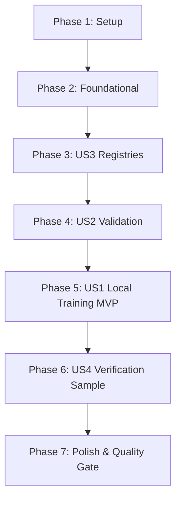

# Implementation Tasks: Distributed Training Engine

**Feature**: [Distributed Training Engine](spec.md)
**Plan**: [Implementation Plan](plan.md)
**Status**: Completed
**Date**: 2026-08-30

---

## Phase 1: Setup (Shared Infrastructure)

**Purpose**: Project initialization, directory structure, and shared error handling

- [X] T001 Create directory structure under src/distributed_training_engine/ and samples/training_test/ per implementation plan
- [X] T002 [P] Create package initializers in src/distributed_training_engine/__init__.py and src/distributed_training_engine/training/__init__.py
- [X] T003 [P] Create domain exceptions and error classes in src/distributed_training_engine/training/exceptions.py

---

## Phase 2: Foundational (Blocking Prerequisites)

**Purpose**: Core DTOs and type-agnostic orchestration interfaces that MUST be complete before specific adapters and workflows can be implemented

**⚠️ CRITICAL**: No user story work can begin until this phase is complete

- [X] T004 [P] Implement ModelType enum in src/distributed_training_engine/training/model_type.py
- [X] T005 [P] Implement TrainingTask DTO with serialization/deserialization support in src/distributed_training_engine/training/training_task_model.py
- [X] T006 [P] Implement TrainingResult DTO in src/distributed_training_engine/training/training_result.py
- [X] T007 Implement abstract base class TrainingAdapter in src/distributed_training_engine/training/training_adapter.py
- [X] T008 Implement TrainingAdapterRegistry in src/distributed_training_engine/training/training_adapter_registry.py
- [X] T009 Implement type-agnostic TrainingOrchestrator in src/distributed_training_engine/training/training_orchestrator.py

**Checkpoint**: Foundation ready - user story implementations and component registries can now proceed.

---

## Phase 3: User Story 3 - Extensible Component Registries (Priority: P3)

**Goal**: Provide pluggable, strongly typed registries for optimizers, schedulers, and loss criteria with parameter DTOs, decoupling algorithm creation from the training loop.

**Independent Test**: Instantiate parameter DTOs for supported optimizers (AdamW, SGD), schedulers (ConstantLR, LinearLR, StepLR, ExponentialLR, CosineAnnealingLR), and criteria (MSELoss, L1Loss, SmoothL1Loss, CrossEntropyLoss, BCEWithLogitsLoss), verifying that registry creation creates valid PyTorch objects and rejects invalid parameters.

### Implementation for User Story 3

- [X] T010 [P] [US3] Implement AdamWParameters and SGDParameters DTOs in src/distributed_training_engine/training/training_adapters/canonical_torch/optimizers/adamw_parameters.py and src/distributed_training_engine/training/training_adapters/canonical_torch/optimizers/sgd_parameters.py
- [X] T011 [P] [US3] Implement OptimizerRegistry in src/distributed_training_engine/training/training_adapters/canonical_torch/optimizer_registry.py
- [X] T012 [P] [US3] Implement scheduler parameter DTOs (ConstantLRParameters, LinearLRParameters, StepLRParameters, ExponentialLRParameters, CosineAnnealingLRParameters) in src/distributed_training_engine/training/training_adapters/canonical_torch/schedulers/
- [X] T013 [P] [US3] Implement SchedulerRegistry in src/distributed_training_engine/training/training_adapters/canonical_torch/scheduler_registry.py
- [X] T014 [P] [US3] Implement criterion parameter DTOs (MSELossParameters, L1LossParameters, SmoothL1LossParameters, CrossEntropyLossParameters, BCEWithLogitsLossParameters) in src/distributed_training_engine/training/training_adapters/canonical_torch/criteria/
- [X] T015 [P] [US3] Implement CriterionRegistry in src/distributed_training_engine/training/training_adapters/canonical_torch/criterion_registry.py
- [X] T016 [P] [US3] Implement package exports in src/distributed_training_engine/training/training_adapters/canonical_torch/__init__.py

**Checkpoint**: All component registries and parameter DTOs are functional and ready to be consumed by configuration models and adapters.

---

## Phase 4: User Story 2 - Pre-Flight Task, Model, and Dataset Validation (Priority: P2)

**Goal**: Implement comprehensive pre-flight validation rules that verify task schemas, configuration parameter ranges, file existence, and tensor shapes/dtypes before training begins.

**Independent Test**: Pass invalid task DTOs, missing checkpoint/shard paths, or corrupted dataset shards to `validate()` and `prepare()`, verifying that descriptive domain exceptions are raised without executing optimization steps or altering files.

### Implementation for User Story 2

- [X] T017 [P] [US2] Implement strongly typed CanonicalTorchTrainingConfig in src/distributed_training_engine/training/training_adapters/canonical_torch/canonical_torch_config.py
- [X] T018 [US2] Implement task schema validation, hyperparameter range checks, and registry integration in CanonicalTorchAdapter.validate() in src/distributed_training_engine/training/training_adapters/canonical_torch/canonical_torch_adapter.py
- [X] T019 [US2] Implement file existence verification and canonical dataset tensor contract validation (x, y float32 checks) in src/distributed_training_engine/training/training_adapters/canonical_torch/canonical_torch_adapter.py
- [X] T020 [US2] Implement exported program contract validation (torch.export.load and module compatibility) in src/distributed_training_engine/training/training_adapters/canonical_torch/canonical_torch_adapter.py

**Checkpoint**: Validation layer successfully intercepts invalid configurations and files before compute allocation.

---

## Phase 5: User Story 1 - Local Execution of Canonical PyTorch Training Task (Priority: P1) 🎯 MVP

**Goal**: Execute a complete local training task using canonical PyTorch exported programs and dataset shards, training model weights via autograd, handling accumulation and clipping, and saving output checkpoint artifacts.

**Independent Test**: Invoke `TrainingOrchestrator.run(task, work_dir)` on a valid task, verifying that model weights update, loss decreases, input files remain immutable, `trained_<task_id>.pt2` is exported, and `TrainingResult` is returned.

### Implementation for User Story 1

- [X] T021 [US1] Implement prepare() method (loading checkpoint, dataset, TensorDataset, DataLoader, device placement) in src/distributed_training_engine/training/training_adapters/canonical_torch/canonical_torch_adapter.py
- [X] T022 [US1] Implement autograd training loop in train() with gradient accumulation, loss scaling, clipping (max_grad_norm), optimizer step, and scheduler sequencing in src/distributed_training_engine/training/training_adapters/canonical_torch/canonical_torch_adapter.py
- [X] T023 [US1] Implement step-based stopping (max_steps), epoch completion, and remainder accumulation handling in src/distributed_training_engine/training/training_adapters/canonical_torch/canonical_torch_adapter.py
- [X] T024 [US1] Implement save_result() exporting trained_<task_id>.pt2 via torch.export.save() and returning TrainingResult in src/distributed_training_engine/training/training_adapters/canonical_torch/canonical_torch_adapter.py
- [X] T025 [US1] Register CanonicalTorchAdapter with TrainingAdapterRegistry for ModelType.CANONICAL_TORCH in src/distributed_training_engine/training/training_adapter_registry.py

**Checkpoint**: Core MVP training workflow is fully functional and capable of executing real canonical PyTorch training tasks.

---

## Phase 6: User Story 4 - End-to-End Verification Sample and Tracing (Priority: P4)

**Goal**: Provide a runnable sample test suite (setup.py, train.py, README.md) under `samples/training_test/` along with structured observability logging across all lifecycle milestones.

**Independent Test**: Run `python samples/training_test/setup.py` followed by `python samples/training_test/train.py`, verifying zero errors, structured console logs for each lifecycle stage, and creation of `trained_task-001.pt2`.

### Implementation for User Story 4

- [X] T026 [P] [US4] Implement structured logging for orchestrator and adapter lifecycle milestones in src/distributed_training_engine/training/training_orchestrator.py and src/distributed_training_engine/training/training_adapters/canonical_torch/canonical_torch_adapter.py
- [X] T027 [P] [US4] Implement sample setup script generating 2-layer MLP .pt2 and float32 dataset shard .pt in samples/training_test/setup.py
- [X] T028 [US4] Implement sample training script running orchestrator, logging progress, and verifying result in samples/training_test/train.py
- [X] T029 [P] [US4] Create comprehensive test documentation and instructions in samples/training_test/README.md

**Checkpoint**: End-to-end verification harness runs cleanly and confirms operational readiness.

---

## Phase 7: Polish & Cross-Cutting Concerns

**Purpose**: Quality gate verification, syntax checking, and final packaging per TrainSwarm Constitution

- [X] T030 [P] Add root package exports and docstrings in src/distributed_training_engine/__init__.py
- [X] T031 Run syntax and build compilation checks across all engine files using python -m py_compile
- [X] T032 Execute live verification suite samples/training_test/setup.py and samples/training_test/train.py per quickstart guide

---

## Dependencies & Execution Order

### Phase Dependencies

- **Phase 1 (Setup)**: Can start immediately.
- **Phase 2 (Foundational)**: Depends on Phase 1; blocks all user stories.
- **Phase 3 (US3 Registries)**: Depends on Phase 2; provides optimizer/scheduler/loss building blocks.
- **Phase 4 (US2 Validation)**: Depends on Phase 3 parameter DTOs.
- **Phase 5 (US1 Execution)**: Depends on Phase 4 validation and loading logic.
- **Phase 6 (US4 Samples)**: Depends on Phase 5 functional engine.
- **Phase 7 (Polish)**: Depends on all previous phases.

### Parallel Opportunities

- **Phase 1**: T002 and T003 can be implemented in parallel.
- **Phase 2**: T004, T005, and T006 can be implemented in parallel.
- **Phase 3**: T010, T011, T012, T013, T014, T015 can all be implemented in parallel (separate registry modules).
- **Phase 4**: T017 can be implemented in parallel with registry exports.
- **Phase 6**: T026, T027, T029 can be developed in parallel.

---

## Implementation Strategy

### MVP First (Phases 1-5)
1. Complete Setup and Foundational DTOs / orchestrator (Phases 1-2).
2. Implement component registries (Phase 3).
3. Implement validation and configuration (Phase 4).
4. Implement `prepare()`, `train()`, `save_result()` in `CanonicalTorchAdapter` (Phase 5).
5. **STOP and VALIDATE**: Confirm single training run executes cleanly.

### Verification & Hand-off (Phases 6-7)
1. Create `samples/training_test/setup.py` and `train.py` (Phase 6).
2. Execute syntax checks (`python -m py_compile`) and live run (`train.py`) (Phase 7).
