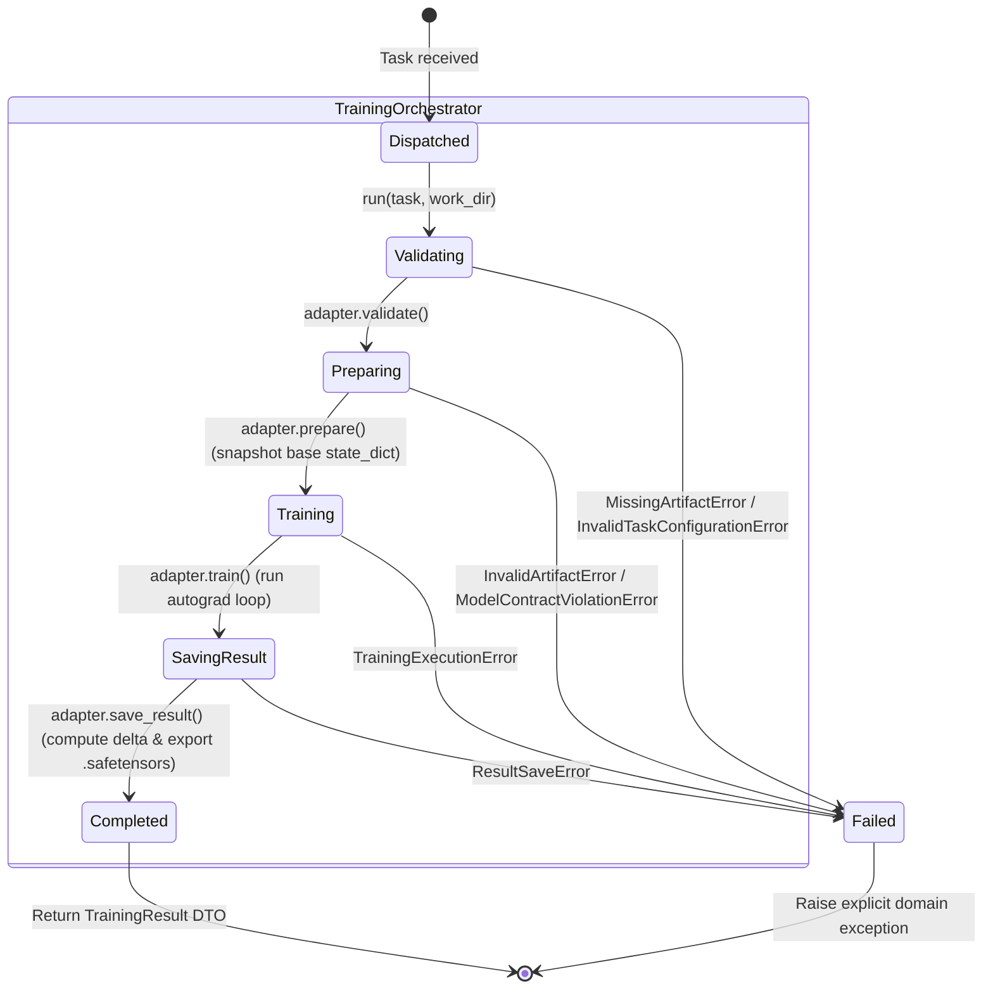

# Data Model: Training Result Standard & Delta Artifacts

**Feature**: `008-training-result-standard`  
**Date**: 2026-09-02  
**Status**: Completed  

---

## 1. Entities & Data Transfer Objects

### 1.1 `TrainingTask`

Represents a single local training task dispatched to a Trainer node.

| Field | Type | Description | Required | Validation Rules |
|-------|------|-------------|----------|------------------|
| `training_task_id` | `str` | Unique identifier for the training task | Yes | Non-empty string, non-whitespace |
| `baseline_model_id` | `str` | Logical model identifier (e.g., `"base_model"`) | Yes | Non-empty string |
| `baseline_model_version` | `str` | Immutable baseline checkpoint version (e.g., `"v1"`) | Yes | Non-empty string |
| `data_set_id` | `str` | Logical dataset identifier (e.g., `"dataset1"`) | Yes | Non-empty string |
| `data_set_shard_id` | `str` | Dataset shard identifier (e.g., `"shard1"`) | Yes | Non-empty string |
| `type` | `str` | Training adapter type (e.g., `"canonical_torch"`) | Yes | Must match a registered adapter type in `TrainingAdapterRegistry` |
| `training` | `Dict[str, Any]` | Type-specific hyperparameters (batch size, epochs, optimizer, etc.) | Yes | Must be a dictionary, deserializable by target adapter config |

#### Invariant & Resolution Rules
- Baseline Model File: `{working_directory}/{baseline_model_id}_{baseline_model_version}.pt2`
- Dataset Shard File: `{working_directory}/{data_set_id}_{data_set_shard_id}.pt`
- Deprecated Fields: `session_id`, `task_id`, `checkpoint_version`, `dataset_shard_id` are completely removed.

---

### 1.2 `TrainingResult`

Represents the finalized training result envelope returned after local task completion.

| JSON Field (Wire) | Python Property | Type | Description | Required |
|-------------------|-----------------|------|-------------|----------|
| `trainingTaskId` | `training_task_id` | `str` | Matching task identifier | Yes |
| `baseModelId` | `base_model_id` | `str` | Logical baseline model ID | Yes |
| `baseModelVersion` | `base_model_version` | `str` | Immutable baseline model version | Yes |
| `datasetId` | `dataset_id` | `str` | Logical dataset ID | Yes |
| `datasetShardId` | `dataset_shard_id` | `str` | Dataset shard ID | Yes |
| `samplesTrained` | `samples_trained` | `int` | Total number of data samples processed across all epochs/steps | Yes |
| `metrics` | `metrics` | `Dict[str, Any]` | Metrics dictionary (e.g., `loss`, `loss_history`, `device`) | Yes |
| `execution` | `execution` | `ExecutionInfo` | Execution timing and duration telemetry | Yes |
| `delta` | `delta` | `DeltaArtifactInfo` | Metadata describing the exported `.safetensors` delta | Yes |

---

### 1.3 `ExecutionInfo`

Telemetry DTO capturing execution start, completion, and duration.

| JSON Field (Wire) | Python Property | Type | Description | Validation |
|-------------------|-----------------|------|-------------|------------|
| `startedAt` | `started_at` | `str` | UTC ISO-8601 timestamp at orchestrator run start | Valid ISO-8601 string (e.g. `2026-09-02T21:30:00Z`) |
| `completedAt` | `completed_at` | `str` | UTC ISO-8601 timestamp at result save completion | Valid ISO-8601 string, must be >= `startedAt` |
| `durationMs` | `duration_ms` | `int` | Elapsed wall-clock time in milliseconds | Non-negative integer |

---

### 1.4 `DeltaArtifactInfo`

Metadata DTO describing the generated delta artifact file.

| JSON Field (Wire) | Python Property | Type | Description | Validation |
|-------------------|-----------------|------|-------------|------------|
| `filename` | `filename` | `str` | Filename of the saved delta file | Matches `<baseline_model_id>_<baseline_model_version>_<data_set_id>_<data_set_shard_id>.safetensors` |
| `path` | `path` | `str` | Absolute path to the delta file | Existing readable file on disk |
| `format` | `format` | `str` | Format indicator | Constant `"safetensors"` |
| `tensorCount` | `tensor_count` | `int` | Number of parameter tensors in delta | Positive integer matching base model parameter tensor count |
| `sizeBytes` | `size_bytes` | `int` | Size of delta file on disk in bytes | Positive integer |

---

## 2. Training Lifecycle State Model

---

## 3. Mathematical Delta & Reconstruction Model

### Delta Generation (Trainer)
Given base model parameter tensors $B = \{k: T_{B,k}\}$ and trained model parameter tensors $T = \{k: T_{T,k}\}$:
$$\forall k \in \text{keys}(B): \Delta_k = T_{T,k} - T_{B,k}$$
The exported `.safetensors` contains mapping $\{k \mapsto \Delta_k\}$.

### Reconstruction (Downstream / Verification)
Given baseline model $B$ and delta artifact $\Delta$:
$$\forall k \in \text{keys}(B): T_{\text{reconstructed},k} = T_{B,k} + \Delta_k$$
Reconstruction condition:
$$\max_k \| T_{\text{reconstructed},k} - T_{T,k} \|_\infty < 10^{-6}$$
