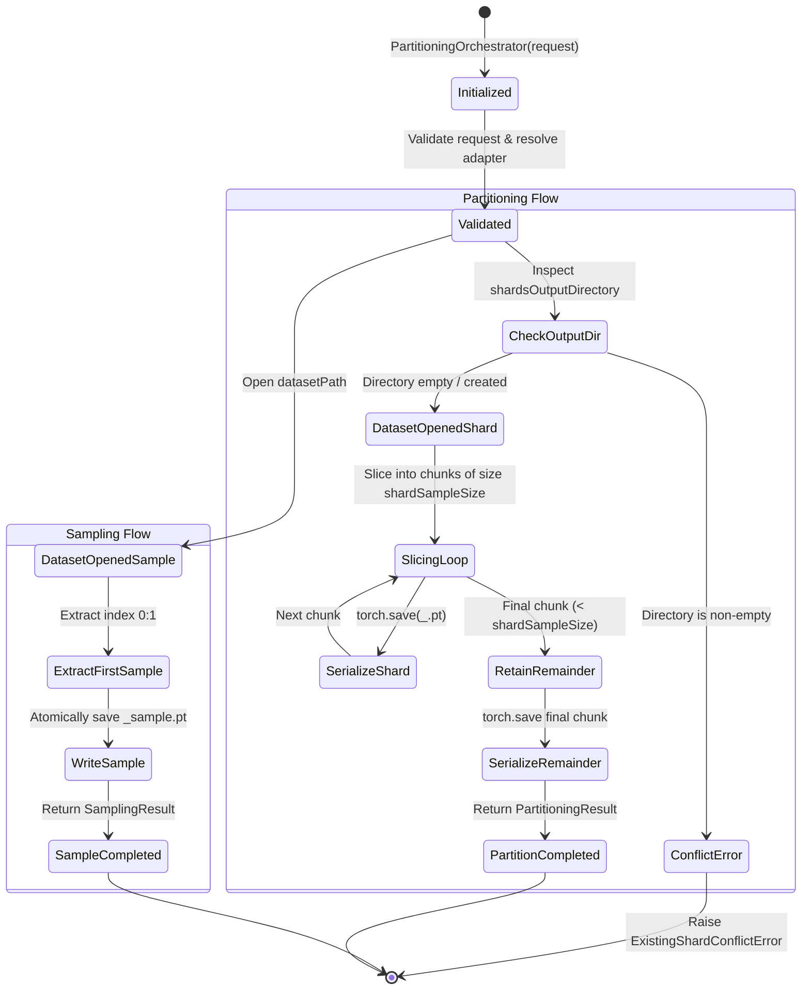

# Data Model: Distributed Training Engine — Partitioning Subsystem

**Feature**: `009-dataset-partitioning`  
**Date**: 2026-09-03  
**Status**: Complete

---

## 1. Core Entities & Value Objects

### 1.1 `ModelType` (Enum)
Defined in `src/distributed_training_engine/model_type.py`.

```python
class ModelType(str, Enum):
    CANONICAL_TORCH = "canonical_torch"
```

---

### 1.2 `PartitioningRequest` (DTO)
Defined in `src/distributed_training_engine/partitioning/partitioning_request.py`.
Encapsulates the configuration and filesystem boundaries for dataset partitioning and sampling.

| Field | Type | Required | Description | Validation Rules |
| :--- | :--- | :---: | :--- | :--- |
| `model_type` | `ModelType` | Yes | Target model/framework type | Must be a member of `ModelType` enum |
| `datasetPath` | `Union[str, Path]` | Yes | Path to raw input dataset | Must be non-empty; resolved to `Path` |
| `shardsOutputDirectory` | `Union[str, Path]` | Yes | Directory where shards are persisted | Must be non-empty; resolved to `Path` |
| `sampleOutputDirecotry` | `Union[str, Path]` | Yes | Directory where sample is persisted | Must be non-empty; resolved to `Path` |
| `datasetId` | `str` | Yes | Identifier of the dataset | Non-empty string |

**Validation Constraints**:
- `validate()` method enforces that strings are non-empty and `model_type` is valid.
- Paths are normalized to `pathlib.Path` objects.

---

### 1.3 `SamplingResult` (DTO)
Defined in `src/distributed_training_engine/partitioning/sampling_result.py`.
Represents the metadata produced by `CreateSample()` / `GetSample()`.

| Field | Type | Required | Description | Validation Rules |
| :--- | :--- | :---: | :--- | :--- |
| `datasetId` | `str` | Yes | Identifier of the sampled dataset | Matches request `datasetId` |
| `samplePath` | `str` | Yes | Absolute or canonical path to `<dataset_id>_sample.pt` | Must refer to a valid file path on disk |
| `sampleCount` | `int` | Yes | Number of representative samples (default: 1) | Must be positive (`>= 1`) |

**Wire Representation (Dictionary / JSON)**:
```json
{
  "datasetId": "dataset-001",
  "samplePath": "C:/path/to/samples/dataset-001_sample.pt",
  "sampleCount": 1
}
```

---

### 1.4 `PartitionedShard` (Value Object)
Defined in `src/distributed_training_engine/partitioning/partitioning_result.py`.
Describes an individual serialized training shard.

| Field | Type | Required | Description | Validation Rules |
| :--- | :--- | :---: | :--- | :--- |
| `shardId` | `str` | Yes | Unique UUID string identifying the shard | Valid UUID v4 string |
| `sampleCount` | `int` | Yes | Number of training samples in this shard | `sampleCount > 0` |
| `artifactPath` | `str` | Yes | File path to the serialized `.pt` shard file | Must end with `<datasetId>_<shardId>.pt` |

---

### 1.5 `PartitioningResult` (DTO)
Defined in `src/distributed_training_engine/partitioning/partitioning_result.py`.
Encapsulates the complete result of a partitioning operation.

| Field | Type | Required | Description | Validation Rules |
| :--- | :--- | :---: | :--- | :--- |
| `datasetId` | `str` | Yes | Identifier of the dataset partitioned | Matches request `datasetId` |
| `shardCount` | `int` | Yes | Total number of shards created | Must equal `len(shards)` |
| `shards` | `List[PartitionedShard]` | Yes | Metadata for every generated shard | Non-empty list if dataset > 0 samples |

**Wire Representation (Dictionary / JSON)**:
```json
{
  "datasetId": "dataset-001",
  "shardCount": 3,
  "shards": [
    {
      "shardId": "3b9b46e2-5701-499b-bf20-c751a7d65b11",
      "sampleCount": 2250,
      "artifactPath": "output/shards/dataset-001_3b9b46e2-5701-499b-bf20-c751a7d65b11.pt"
    },
    {
      "shardId": "8f12a9c4-11e2-4bd5-9981-d02fa38291aa",
      "sampleCount": 2250,
      "artifactPath": "output/shards/dataset-001_8f12a9c4-11e2-4bd5-9981-d02fa38291aa.pt"
    },
    {
      "shardId": "0982cba1-84de-412e-a579-22a01f98bc43",
      "sampleCount": 500,
      "artifactPath": "output/shards/dataset-001_0982cba1-84de-412e-a579-22a01f98bc43.pt"
    }
  ]
}
```

---

## 2. Partitioning Error Hierarchy

Defined in `src/distributed_training_engine/partitioning/exceptions.py`.

```text
PartitioningError (base)
├── InvalidPartitioningConfigurationError (malformed request or parameters)
├── InvalidShardSampleSizeError (shardSampleSize <= 0 or not an int)
├── DatasetAccessError (dataset file missing or unreadable)
├── DatasetFormatError (missing tensors, mismatched dimensions, corrupt samples)
├── ShardSerializationError (failure during torch.save of shard artifact)
├── OutputDirectoryError (failure creating or accessing output directory)
├── ExistingShardConflictError (shardsOutputDirectory is non-empty)
├── UnsupportedModelTypeError (unknown ModelType provided)
├── PartitionerAdapterNotFoundError (no adapter registered for ModelType)
└── PartitioningOperationError (general unrecoverable partitioning failure)
```

---

## 3. Subsystem Lifecycle & State Machine


