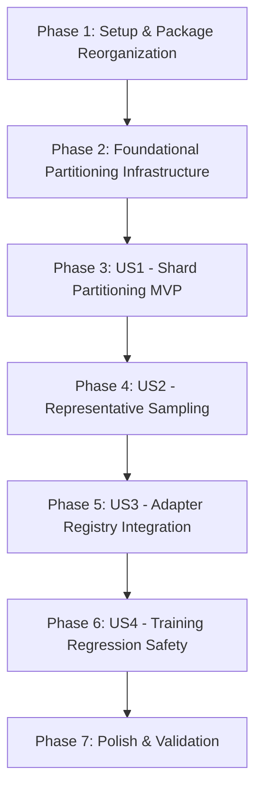

# Tasks: Distributed Training Engine — Partitioning Module and Folder Structure

**Branch**: `009-dataset-partitioning` | **Spec**: [spec.md](file:///C:/Users/azure-dev/dev/TrainSwarm/specs/009-dataset-partitioning/spec.md) | **Plan**: [plan.md](file:///C:/Users/azure-dev/dev/TrainSwarm/specs/009-dataset-partitioning/plan.md)

---

## Phase 1: Setup & Package Reorganization

**Purpose**: Restructure `src/distributed_training_engine/` into target subsystem directories while preserving existing training capability.

- [X] T001 Move ModelType enum to package root in `src/distributed_training_engine/model_type.py`
- [X] T002 [P] Reorganize training files in `src/distributed_training_engine/training/` (rename `training_adapter.py` to `trainer_adapter.py`, `training_adapter_registry.py` to `trainer_adapter_registery.py`, and `training_orchestrator.py` to `training_orchecstrator.py`)
- [X] T003 [P] Relocate canonical torch training adapter to `src/distributed_training_engine/adapters/canonical_torch/training/` (rename `canonical_torch_adapter.py` to `canonical_torch_trainer.py` and move config, criteria, optimizers, and schedulers)
- [X] T004 [P] Create aggregation placeholder scaffolding in `src/distributed_training_engine/aggregation/` (`__init__.py`, `exceptions.py`, `aggregator_adapter_registery.py`, `aggregator_adapter.py`, `aggregation_request.py`, `aggregation_result.py`, and `aggregation_orchecstrator.py`)
- [X] T005 [P] Create canonical torch aggregation placeholder in `src/distributed_training_engine/adapters/canonical_torch/aggragation/canonical_torch_aggregator.py`
- [X] T006 Update package exports and backward-compatible aliases in `src/distributed_training_engine/training/__init__.py` and `src/distributed_training_engine/__init__.py`

---

## Phase 2: Foundational (Partitioning Core Infrastructure)

**Purpose**: Core partitioning DTO models, exception hierarchy, abstract contracts, and orchestrator lifecycle coordinator.

**CRITICAL**: Foundational tasks must complete before user story implementation can begin.

- [X] T007 Implement partitioning exception hierarchy in `src/distributed_training_engine/partitioning/exceptions.py`
- [X] T008 [P] Implement PartitioningRequest DTO with input validation in `src/distributed_training_engine/partitioning/partitioning_request.py`
- [X] T009 [P] Implement SamplingResult DTO in `src/distributed_training_engine/partitioning/sampling_result.py`
- [X] T010 [P] Implement PartitionedShard and PartitioningResult DTOs in `src/distributed_training_engine/partitioning/partitioning_result.py`
- [X] T011 Implement abstract PartitionerAdapter base contract in `src/distributed_training_engine/partitioning/partitioner_adapter.py`
- [X] T012 Implement PartitionerAdapterRegistry in `src/distributed_training_engine/partitioning/partitioner_adapter_registery.py`
- [X] T013 Implement PartitioningOrchestrator coordinator in `src/distributed_training_engine/partitioning/partitioning_orchecstrator.py`
- [X] T014 Export partitioning symbols and public API in `src/distributed_training_engine/partitioning/__init__.py`

**Checkpoint**: Core partitioning contracts, exceptions, registry, and orchestrator are ready.

---

## Phase 3: User Story 1 - Dataset Partitioning into Shards by Sample Count (Priority: P1) [MVP]

**Goal**: Slices a raw dataset into fixed-size shards by sample count, generates UUID shard identifiers, writes `<datasetId>_<shardId>.pt` artifacts, preserves remainder shards, and detects non-empty output directory collisions.

**Independent Test**: Provide a PyTorch dataset (e.g. 10 samples) and call `CreateShards(shardSampleSize=4)`. Verify 3 shards produced (4, 4, 2 samples), formatted as `<datasetId>_<shardId>.pt` in `shardsOutputDirectory`, and verify that calling `CreateShards()` again on the non-empty directory raises `ExistingShardConflictError`.

- [X] T015 [US1] Create partitioner module directory and init in `src/distributed_training_engine/adapters/canonical_torch/partitioning/__init__.py`
- [X] T016 [US1] Implement dataset loading, tensor dictionary validation, and empty-directory collision check in `src/distributed_training_engine/adapters/canonical_torch/partitioning/canonical_torch_partitioner.py`
- [X] T017 [US1] Implement deterministic tensor chunking and UUID shard generation in `src/distributed_training_engine/adapters/canonical_torch/partitioning/canonical_torch_partitioner.py`
- [X] T018 [US1] Implement shard serialization (`torch.save`) and remainder preservation in `src/distributed_training_engine/adapters/canonical_torch/partitioning/canonical_torch_partitioner.py`
- [X] T019 [US1] Wire `CreateShards()` in `PartitioningOrchestrator` to validate `shardSampleSize` and return `PartitioningResult` in `src/distributed_training_engine/partitioning/partitioning_orchecstrator.py`

**Checkpoint**: User Story 1 (MVP) is fully functional and capable of partitioning datasets into serialized PyTorch shards with collision prevention.

---

## Phase 4: User Story 2 - Representative Dataset Sampling (Priority: P2)

**Goal**: Extracts a single representative sample from the dataset (`x[0:1]`, `y[0:1]`), atomically overwrites `<dataset_id>_sample.pt` in `sampleOutputDirecotry`, and returns a `SamplingResult`.

**Independent Test**: Call `PartitioningOrchestrator.GetSample()` on a valid dataset. Verify that `<dataset_id>_sample.pt` is created with 1 sample in canonical tensor format and subsequent calls atomically replace it without collision errors.

- [X] T020 [US2] Implement `CreateSample()` extraction logic and directory auto-creation in `src/distributed_training_engine/adapters/canonical_torch/partitioning/canonical_torch_partitioner.py`
- [X] T021 [US2] Implement atomic sample overwrite and `SamplingResult` generation in `src/distributed_training_engine/adapters/canonical_torch/partitioning/canonical_torch_partitioner.py`
- [X] T022 [US2] Wire `GetSample()` in `PartitioningOrchestrator` to invoke `CreateSample()` on the resolved adapter in `src/distributed_training_engine/partitioning/partitioning_orchecstrator.py`

**Checkpoint**: User Story 2 is functional and provides representative dataset sampling for pre-flight validation.

---

## Phase 5: User Story 3 - Model-Agnostic Abstraction and Adapter Registry (Priority: P3)

**Goal**: Ensures `PartitionerAdapterRegistry` resolves `CanonicalTorchPartitioner` by `ModelType.CANONICAL_TORCH` and raises `PartitionerAdapterNotFoundError` for unregistered types without model-type branching in the orchestrator.

**Independent Test**: Query `PartitionerAdapterRegistry.Get(ModelType.CANONICAL_TORCH)` and verify `CanonicalTorchPartitioner` is returned; query an unsupported model type and verify `PartitionerAdapterNotFoundError` is raised.

- [X] T023 [US3] Register `CanonicalTorchPartitioner` for `ModelType.CANONICAL_TORCH` in `src/distributed_training_engine/partitioning/__init__.py` and `src/distributed_training_engine/adapters/canonical_torch/__init__.py`
- [X] T024 [US3] Ensure `PartitionerAdapterRegistry` lookup raises contextual `PartitionerAdapterNotFoundError` in `src/distributed_training_engine/partitioning/partitioner_adapter_registery.py`
- [X] T025 [US3] Validate that `PartitioningOrchestrator` resolves adapters strictly via registry without model-specific conditionals in `src/distributed_training_engine/partitioning/partitioning_orchecstrator.py`

**Checkpoint**: User Story 3 is functional with clean decoupling between orchestrator and adapter registry.

---

## Phase 6: User Story 4 - Package Reorganization and Regression Safety (Priority: P4)

**Goal**: Validate that moving and renaming training files maintains 100% backward compatibility and zero regressions for existing training workflows.

**Independent Test**: Run `python samples/training_test/setup.py`, `python samples/training_test/train.py`, and `python samples/training_test/verify.py` to confirm clean execution, parameter updates, and mathematical verification parity.

- [X] T026 [US4] Update import paths in `samples/training_test/train.py` and `samples/training_test/README.md` to reference reorganized modules while confirming compatibility aliases
- [X] T027 [US4] Verify build compilability and syntax integrity across all reorganized files using `python -m py_compile`
- [X] T028 [US4] Execute end-to-end training sample workflow (`setup.py`, `train.py`, `verify.py`) to confirm zero regressions in training execution

**Checkpoint**: All 4 user stories are functional and existing training features run without regression.

---

## Phase 7: Polish & Validation

**Purpose**: End-to-end verification, logging completeness, and quality gate sign-off per TrainSwarm Constitution.

- [X] T029 Add structured tracing logs across partitioning request validation, sample extraction, and shard serialization in `src/distributed_training_engine/partitioning/partitioning_orchecstrator.py` and `src/distributed_training_engine/adapters/canonical_torch/partitioning/canonical_torch_partitioner.py`
- [X] T030 Execute complete validation workflow per `quickstart.md` (sampling, sharding, remainder preservation, and collision prevention)
- [X] T031 Run full repository compilability check via `python -m py_compile` across all modified and newly introduced files

---

## Dependencies & Execution Order

### Phase Dependencies

### User Story Dependencies

- **User Story 1 (P1)**: Depends on Phase 2 (Foundational). Delivers the core sharding capability (MVP).
- **User Story 2 (P2)**: Extends `CanonicalTorchPartitioner` and `PartitioningOrchestrator` with sampling logic.
- **User Story 3 (P3)**: Connects default adapter registration in the registry and validates model-agnostic resolution.
- **User Story 4 (P4)**: Validates sample training workflows and ensures zero regressions from folder reorganization.

### Parallel Opportunities

- **Phase 1**: T002, T003, T004, and T005 can be implemented in parallel across their respective target folders.
- **Phase 2**: T008, T009, and T010 (DTO models) can be implemented in parallel.
- **Phase 6**: T026, T027, and T028 can be executed sequentially to verify regression safety.

---

## Implementation Strategy

### MVP First (Phases 1, 2, and 3)
1. Complete Phase 1 (Reorganization) and Phase 2 (Foundational DTOs & Contracts).
2. Implement Phase 3 (User Story 1: `CanonicalTorchPartitioner.CreateShards()` and `PartitioningOrchestrator`).
3. **Validate MVP**: Verify that a sample dataset is partitioned into UUID-named shards, remainders are preserved, and non-empty output collisions are rejected.

### Incremental Feature Expansion
4. Add User Story 2 (Representative sampling via `GetSample()`).
5. Add User Story 3 (Registry registration & decoupling).
6. Validate User Story 4 (End-to-end training sample execution).
7. Final polish and compilability sign-off.
