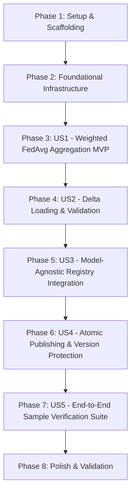

# Tasks: Distributed Training Engine — Aggregation Module

**Branch**: `010-distributed-training-aggregation` | **Spec**: [spec.md](file:///C:/Users/azure-dev/dev/TrainSwarm/specs/010-distributed-training-aggregation/spec.md) | **Plan**: [plan.md](file:///C:/Users/azure-dev/dev/TrainSwarm/specs/010-distributed-training-aggregation/plan.md)

---

## Phase 1: Setup & Scaffolding

**Purpose**: Verify and prepare folder structure for the aggregation subsystem while maintaining package stability.

- [X] T001 Verify and prepare folder structure in `src/distributed_training_engine/aggregation/` and `src/distributed_training_engine/adapters/canonical_torch/aggragation/`
- [X] T002 [P] Configure module re-exports in `src/distributed_training_engine/aggregation/__init__.py` and `src/distributed_training_engine/__init__.py`

---

## Phase 2: Foundational (Aggregation Core Infrastructure)

**Purpose**: Core DTO models, exception hierarchy, abstract contracts, and orchestrator lifecycle coordinator.

**CRITICAL**: Foundational tasks must complete before user story implementation can begin.

- [X] T003 [P] Implement aggregation exception hierarchy in `src/distributed_training_engine/aggregation/exceptions.py`
- [X] T004 [P] Implement ModelUpdate and AggregationRequest DTOs with input validation in `src/distributed_training_engine/aggregation/aggregation_request.py`
- [X] T005 [P] Implement AggregationResult DTO in `src/distributed_training_engine/aggregation/aggregation_result.py`
- [X] T006 Implement abstract AggregatorAdapter base contract in `src/distributed_training_engine/aggregation/aggregator_adapter.py`
- [X] T007 Implement AggregatorAdapterRegistry mapping in `src/distributed_training_engine/aggregation/aggregator_adapter_registery.py`
- [X] T008 Implement AggregationOrchestrator lifecycle coordinator in `src/distributed_training_engine/aggregation/aggregation_orchecstrator.py`

**Checkpoint**: Core aggregation contracts, exceptions, registry, and orchestrator are ready.

---

## Phase 3: User Story 1 - Model-Agnostic Weighted Federated Averaging Aggregation (Priority: P1) [MVP]

**Goal**: Load base model weights, perform sample-weighted Federated Averaging across parameter deltas, reconstruct new model weights, round integer tracking buffers, and produce an AggregationResult while preserving base model immutability.

**Independent Test**: Provide an immutable base model (`gpt2_0.pt2`) and valid trainer deltas with known sample counts (e.g. 10 and 40 samples). Run `AggregationOrchestrator.aggregate()` and verify that the combined delta equals the exact weighted average (`0.2 * Delta1 + 0.8 * Delta2`), applied to base model weights, leaves the base model artifact untouched, and returns a valid `AggregationResult`.

- [X] T009 [US1] Implement base model loading (`torch.export.load`) and base state dict extraction in `src/distributed_training_engine/adapters/canonical_torch/aggragation/canonical_torch_aggregator.py`
- [X] T010 [US1] Implement sample-weighted Federated Averaging algorithm in `float64` accumulator across floating-point parameter tensors in `src/distributed_training_engine/adapters/canonical_torch/aggragation/canonical_torch_aggregator.py`
- [X] T011 [US1] Implement integer tracking buffer weighted averaging with rounding and type casting in `src/distributed_training_engine/adapters/canonical_torch/aggragation/canonical_torch_aggregator.py`
- [X] T012 [US1] Implement reconstructed weight application to base module and result generation in `src/distributed_training_engine/adapters/canonical_torch/aggragation/canonical_torch_aggregator.py`
- [X] T013 [US1] Connect `Aggregate()` and `CreateNewVersion()` execution in `src/distributed_training_engine/aggregation/aggregation_orchecstrator.py`

**Checkpoint**: User Story 1 (MVP) is functional and capable of mathematically combining parameter deltas via weighted FedAvg into new weights.

---

## Phase 4: User Story 2 - Delta Loading and Comprehensive Pre-Aggregation Validation (Priority: P2)

**Goal**: Load delta artifacts via SafeTensors, validate tensor keys, shapes, and dtypes against base model state dict, reject non-positive sample counts, and enforce all-or-nothing failure handling without inspecting filenames or metadata.

**Independent Test**: Run aggregation with an unreadable delta file, mismatched tensor shape, missing tensor key, or `samplesTrained <= 0`. Verify that validation aborts fast with the appropriate exception (`DeltaAccessError`, `TensorCompatibilityError`, `InvalidUpdateError`), zero delta calculations occur, and no model artifact is published.

- [X] T014 [US2] Implement SafeTensors delta file loading via `safetensors.torch.load_file` with explicit exception handling in `src/distributed_training_engine/adapters/canonical_torch/aggragation/canonical_torch_aggregator.py`
- [X] T015 [US2] Implement delta tensor key validation against base model state dict (no missing, no unexpected keys) in `src/distributed_training_engine/adapters/canonical_torch/aggragation/canonical_torch_aggregator.py`
- [X] T016 [US2] Implement delta tensor shape and dtype validation in `src/distributed_training_engine/adapters/canonical_torch/aggragation/canonical_torch_aggregator.py`
- [X] T017 [US2] Enforce `samplesTrained > 0` validation and all-or-nothing failure handling in `src/distributed_training_engine/adapters/canonical_torch/aggragation/canonical_torch_aggregator.py`
- [X] T018 [US2] Connect `LoadDelta()` and `ValidateDelta()` execution into lifecycle in `src/distributed_training_engine/aggregation/aggregation_orchecstrator.py`

**Checkpoint**: User Story 2 is functional with comprehensive pre-flight validation protecting against corrupt or mismatched deltas.

---

## Phase 5: User Story 3 - Model-Agnostic Abstraction and Adapter Registry (Priority: P3)

**Goal**: Decouple model-specific aggregation from orchestrator logic using `AggregatorAdapterRegistry`, enabling registration and lookup by `ModelType` while raising `AggregatorAdapterNotFoundError` for unregistered frameworks.

**Independent Test**: Query `AggregatorAdapterRegistry.Get(ModelType.CANONICAL_TORCH)` and verify `CanonicalTorchAggregator` is returned; query an unsupported model type and confirm `AggregatorAdapterNotFoundError` is raised without model-type branching in the orchestrator.

- [X] T019 [US3] Register `CanonicalTorchAggregator` for `ModelType.CANONICAL_TORCH` in `src/distributed_training_engine/adapters/canonical_torch/aggragation/__init__.py` and `src/distributed_training_engine/aggregation/__init__.py`
- [X] T020 [US3] Implement `AggregatorAdapterRegistry.Get()` lookup with contextual `AggregatorAdapterNotFoundError` in `src/distributed_training_engine/aggregation/aggregator_adapter_registery.py`
- [X] T021 [US3] Verify strict model-agnosticism in `AggregationOrchestrator` ensuring zero PyTorch imports in `src/distributed_training_engine/aggregation/aggregation_orchecstrator.py`

**Checkpoint**: User Story 3 is functional with complete architectural decoupling between orchestration and framework-specific aggregation.

---

## Phase 6: User Story 4 - Atomic Model Creation and Version Protection (Priority: P4)

**Goal**: Enforce target version collision prevention (`ExistingModelVersionConflictError`), auto-create target directories, serialize the new model to a temporary file via `torch.export.save`, and atomically move to final path via `os.replace`.

**Independent Test**: (1) Attempt aggregation when `<modelId>_<newVersion>.pt2` already exists in `newVersionOutputDirectory`, verifying immediate failure. (2) Complete a successful aggregation and verify the file is created atomically without leaving temporary files on disk.

- [X] T022 [US4] Implement pre-flight collision check raising `ExistingModelVersionConflictError` if target version file already exists in `src/distributed_training_engine/adapters/canonical_torch/aggragation/canonical_torch_aggregator.py`
- [X] T023 [US4] Implement target output directory tree auto-creation in `src/distributed_training_engine/adapters/canonical_torch/aggragation/canonical_torch_aggregator.py`
- [X] T024 [US4] Implement atomic serialization to temporary file and rename via `os.replace` with cleanup on failure in `src/distributed_training_engine/adapters/canonical_torch/aggragation/canonical_torch_aggregator.py`
- [X] T025 [US4] Validate base model artifact immutability post-aggregation in `src/distributed_training_engine/adapters/canonical_torch/aggragation/canonical_torch_aggregator.py`

**Checkpoint**: User Story 4 is functional with atomic publishing and strict protection of historical model versions.

---

## Phase 7: User Story 5 - End-to-End Distributed Training and Aggregation Verification Suite (Priority: P5)

**Goal**: Deliver a runnable, zero-mock sample suite under `samples/distributed_training_test/` covering setup, partitioning, 5-worker parallel training, aggregation, and loss improvement verification.

**Independent Test**: Run `python setup.py`, `python partition.py`, `python train.py`, `python aggregate.py`, and `python verify.py` sequentially in `samples/distributed_training_test/`. Verify that all steps exit with code 0 and `verify.py` proves lower loss on `model_1.pt2` compared to `model_0.pt2`.

- [X] T026 [P] [US5] Implement CNN model export (`model_0.pt2`) and 50-sample dataset creation (`dataset.pt`) in `samples/distributed_training_test/setup.py`
- [X] T027 [P] [US5] Implement dataset partitioning into 5 shards of 10 samples each via `PartitioningOrchestrator` in `samples/distributed_training_test/partition.py`
- [X] T028 [US5] Implement parallel training across 5 workers via `concurrent.futures.ProcessPoolExecutor` producing 5 delta files in `samples/distributed_training_test/train.py`
- [X] T029 [US5] Implement model aggregation via `AggregationOrchestrator` publishing `model_1.pt2` in `samples/distributed_training_test/aggregate.py`
- [X] T030 [US5] Implement baseline vs aggregated model loss evaluation and convergence verification in `samples/distributed_training_test/verify.py`
- [X] T031 [P] [US5] Create end-to-end execution guide and architecture documentation in `samples/distributed_training_test/README.md`

**Checkpoint**: All 5 user stories are functional and verified end-to-end through a zero-mock runnable pipeline.

---

## Phase 8: Polish & Validation

**Purpose**: Cross-cutting quality checks, structured logging, compilability verification, and regression safety.

- [X] T032 Add structured diagnostic logging across aggregation orchestrator and adapter in `src/distributed_training_engine/aggregation/aggregation_orchecstrator.py` and `src/distributed_training_engine/adapters/canonical_torch/aggragation/canonical_torch_aggregator.py`
- [X] T033 Run full repository build and syntax compilation checks via `python -m py_compile` across all modified and newly created engine files
- [X] T034 Execute existing training sample verification (`samples/training_test/setup.py`, `train.py`, `verify.py`) to confirm zero regressions in existing training subsystems
- [X] T035 Execute complete new sample suite (`samples/distributed_training_test/setup.py`, `partition.py`, `train.py`, `aggregate.py`, `verify.py`) and confirm 100% pass rate

---

## Dependencies & Execution Order

### Phase Dependencies

### User Story Dependencies

- **User Story 1 (P1)**: Can start after Foundational (Phase 2) - Core FedAvg math and weight reconstruction.
- **User Story 2 (P2)**: Extends US1 with SafeTensors loading and comprehensive pre-aggregation schema validation.
- **User Story 3 (P3)**: Decouples orchestrator from concrete adapter via registry lookup.
- **User Story 4 (P4)**: Hardens publishing with collision detection and atomic file replacement.
- **User Story 5 (P5)**: Integrates partitioning, parallel training, and aggregation into a complete runnable test suite.

### Parallel Opportunities

- **Phase 1 Setup**: T002 can run in parallel with T001.
- **Phase 2 Foundational**: T003, T004, and T005 can run in parallel across separate files.
- **Phase 7 Sample Suite**: T026, T027, and T031 can be drafted in parallel.
- **Phase 8 Polish**: T033, T034, and T035 execute verification commands sequentially after implementation.

---

## Implementation Strategy

### MVP First (User Story 1 Only)
1. Complete Phase 1: Setup & Scaffolding
2. Complete Phase 2: Foundational (DTOs, Exceptions, ABC, Registry, Orchestrator)
3. Complete Phase 3: User Story 1 (Canonical Torch weighted FedAvg and weight reconstruction)
4. **STOP and VALIDATE**: Verify FedAvg mathematical aggregation on sample weights.

### Incremental Delivery
1. Add User Story 2: SafeTensors delta loading and pre-flight schema validation.
2. Add User Story 3: Dynamic adapter registry resolution.
3. Add User Story 4: Atomic file serialization and existing version collision protection.
4. Add User Story 5: Complete runnable multi-worker sample test suite.
5. Run full regression suite (`samples/training_test/`) and quality gate (`python -m py_compile`).
