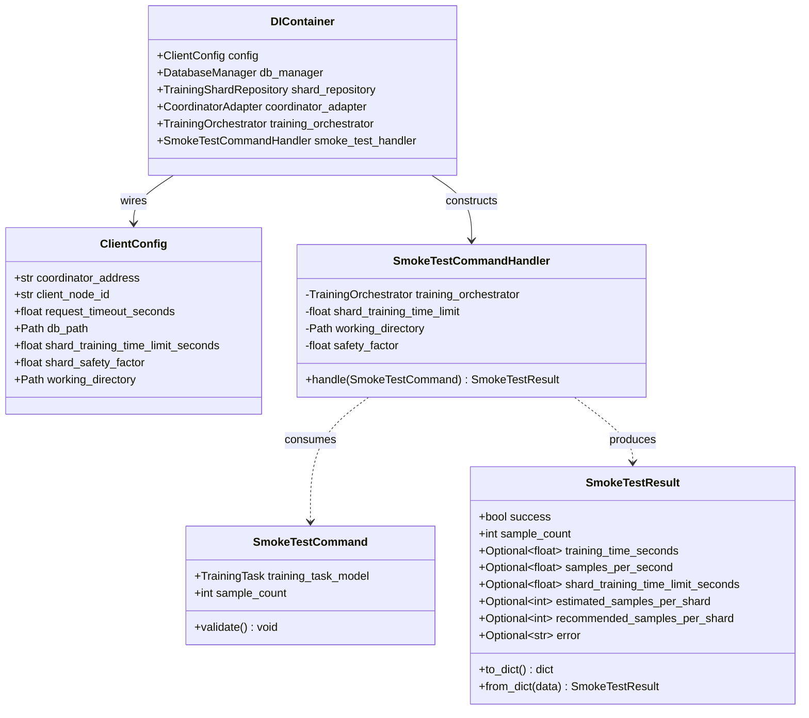
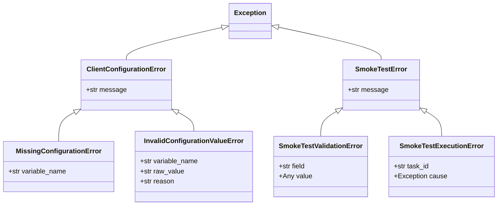
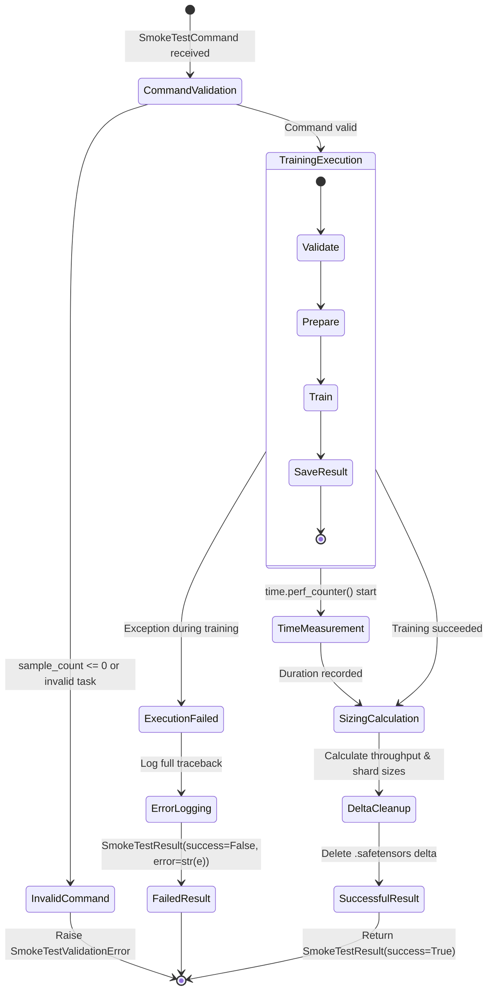

# Phase 1 Data Model: Training Client Configuration, Dependency Injection, and Smoke Test

**Feature Branch**: `014-client-config-smoke-test`  
**Date**: 2026-09-04  
**Author**: Antigravity  
**Status**: Completed  

---

## 1. Entity Overview

---

## 2. Model Specifications

### 2.1 `ClientConfig` (`src/Client/config/config_manager.py`)

Represents the strongly typed, validated client configuration loaded from environment variables and `.env` files.

| Attribute | Type | Required | Default | Validation / Constraints |
|---|---|---|---|---|
| `coordinator_address` | `str` | Yes | N/A | Non-empty string; stripped of trailing slashes; valid URI scheme. |
| `client_node_id` | `str` | No | `"client-node-dev"` | Non-empty string identifier for client instance. |
| `request_timeout_seconds` | `float` | No | `10.0` | Strictly positive (`> 0.0`). |
| `db_path` | `Path` | No | `Path("./training.db")` | Resolved absolute or local filesystem path. |
| `shard_training_time_limit_seconds` | `float` | No | `300.0` | Strictly positive (`> 0.0`). |
| `shard_safety_factor` | `float` | No | `1.0` | Must be $0.0 < \text{factor} \le 1.0$. |
| `working_directory` | `Path` | No | `Path(".")` | Resolved filesystem directory for training task artifacts. |

---

### 2.2 `SmokeTestCommand` (`src/Client/application/smoke_test/smoke_test_command.py`)

Application command DTO requesting training validation and shard sizing calculation.

| Attribute | Type | Required | Description | Validation / Constraints |
|---|---|---|---|---|
| `training_task_model` | `TrainingTask` | Yes | Target training task definition. | Must be an instance of `TrainingTask`; `validate_envelope()` must succeed. |
| `sample_count` | `int` | Yes | Number of samples to train on. | Must be an integer strictly greater than zero (`sample_count > 0`). |

**Validation Method**:
- `validate()`: Raises `SmokeTestValidationError` if `sample_count <= 0` or if `training_task_model` is invalid.

---

### 2.3 `SmokeTestResult` (`src/Client/application/smoke_test/smoke_test_result.py`)

Application result DTO capturing the outcome of the smoke test, timing measurements, throughput, and shard recommendations.

| Attribute | Type | Nullable | Description |
|---|---|---|---|
| `success` | `bool` | No | True if training completed without errors; False on any failure. |
| `sample_count` | `int` | No | Number of samples benchmarked. |
| `training_time_seconds` | `Optional[float]` | Yes | Monotonic elapsed training duration in seconds (`None` on failure). |
| `samples_per_second` | `Optional[float]` | Yes | Calculated throughput: $\text{sample\_count} / \text{training\_time\_seconds}$ (`None` on failure). |
| `shard_training_time_limit_seconds` | `Optional[float]` | Yes | Time budget used for shard sizing calculation. |
| `estimated_samples_per_shard` | `Optional[int]` | Yes | Theoretical samples capacity: $\text{int}(\text{throughput} \times \text{limit})$ (`None` on failure). |
| `recommended_samples_per_shard` | `Optional[int]` | Yes | Recommended partition size: $\text{int}(\text{estimated} \times \text{safety\_factor})$ (`None` on failure). |
| `error` | `Optional[str]` | Yes | Error message or diagnostic details if training failed (`None` on success). |

**Methods**:
- `to_dict() -> dict`: Serializes result for logging and JSON communication.
- `from_dict(data: dict) -> SmokeTestResult`: Deserializes JSON payload into typed result object.

---

### 2.4 `DIContainer` (`src/Client/dependency_injection/container.py`)

Lightweight composition root assembling the Client application graph at startup.

| Property / Factory | Returned Type | Construction Mechanism |
|---|---|---|
| `config` | `ClientConfig` | Resolved from `ConfigManager`. |
| `db_manager` | `DatabaseManager` | `DatabaseManager(db_path=config.db_path, timeout=config.request_timeout_seconds)` |
| `shard_repository` | `TrainingShardRepository` | `TrainingShardRepository(db_manager=self.db_manager)` |
| `coordinator_adapter` | `CoordinatorAdapter` | `CoordinatorAdapter(coordinator_address=config.coordinator_address, timeout_seconds=config.request_timeout_seconds)` |
| `training_orchestrator`| `TrainingOrchestrator` | `TrainingOrchestrator()` from `distributed_training_engine.training` |
| `smoke_test_handler` | `SmokeTestCommandHandler`| `SmokeTestCommandHandler(training_orchestrator=self.training_orchestrator, shard_training_time_limit=config.shard_training_time_limit_seconds, working_directory=config.working_directory, safety_factor=config.shard_safety_factor)` |

---

## 3. Exception Hierarchy

---

## 4. Lifecycle & State Transitions

### Smoke Test Execution Lifecycle

