# Data Model: Training Client — Submit Training Application Command, Dual Presentation, and Shard Lifecycle

**Feature Branch**: `015-client-submit-training`  
**Date**: 2026-09-05  
**Spec Reference**: [spec.md](file:///C:/Users/azure-dev/dev/TrainSwarm/specs/015-client-submit-training/spec.md)

---

## 1. Domain Entities & Enums

### 1.1 `TrainingShardStatus` (Extended)

Represents the lifecycle status of a persistent local dataset training shard in SQLite.

```python
class TrainingShardStatus(str, Enum):
    """Lifecycle status of a local dataset shard."""
    CREATED = "created"       # Partitioned and saved locally, awaiting Coordinator task registration
    READY = "ready"           # Successfully registered with Coordinator, ready for training assignment
    TRAINING = "training"     # Currently assigned and undergoing training execution
    COMPLETED = "completed"   # Training finished and parameter delta produced
    FAILED = "failed"         # Training execution failed
```

### 1.2 `TrainingShard` (Existing Domain Entity)

Represents the local persistent training state of one dataset shard for one model version.

| Attribute | Type | Nullable | Validation Rules | Description |
| :--- | :--- | :---: | :--- | :--- |
| `id` | `str` (UUID) | No | Valid UUID v4 string | Primary key |
| `model_id` | `str` (UUID) | No | Non-empty string UUID | Unique logical identifier of the model family |
| `model_type` | `str` | No | Matches `ModelType` enum | Engine adapter type (e.g. `canonical_torch`) |
| `model_version` | `str` | No | Non-empty string | Version tag (e.g. `v1.0`) |
| `dataset_id` | `str` (UUID) | No | Non-empty string UUID | Unique logical identifier of the source dataset |
| `shard_id` | `str` (UUID) | No | Non-empty string UUID | Partitioned shard identifier |
| `artifact_path` | `str` | No | Non-empty filesystem path | Absolute or relative path to the `.pt` shard file |
| `sample_count` | `int` | No | Strictly > 0 | Number of samples in this shard |
| `status` | `TrainingShardStatus`| No | Defaults to `CREATED` | Current lifecycle state |
| `metrics` | `Dict[str, Any]` | Yes | Valid JSON object | Telemetry dictionary (null initially) |
| `training_metadata`| `Dict[str, Any]` | Yes | Valid JSON object | Execution metadata dictionary (null initially) |
| `update_artifact_path`| `str` | Yes | Valid filesystem path | Path to output delta artifact (null initially) |
| `training_task_id` | `str` | Yes | Coordinator task GUID | Associated swarm task ID (null initially) |

---

## 2. Application Layer DTOs

### 2.1 `SubmitTrainingCommand`

Command payload carrying all required inputs to orchestrate training submission.

```python
@dataclass
class SubmitTrainingCommand:
    """Input parameters for submitting a new model training task."""
    model_path: Union[str, Path]
    dataset_path: Union[str, Path]
    model_version: str
    model_type: Union[str, ModelType]
    training_config: Dict[str, Any]
```

**Validation Invariants**:
- `model_path`: Must exist and be a readable file (`.pt2` for `canonical_torch`).
- `dataset_path`: Must exist and be a readable file (`.pt` for `canonical_torch`).
- `model_version`: Non-empty string after stripping whitespace.
- `model_type`: Valid `ModelType` enum member (e.g. `ModelType.CANONICAL_TORCH`).
- `training_config`: Non-empty dictionary conforming to model-type training schema (e.g. `CanonicalTorchTrainingConfig`).

### 2.2 `SubmitTrainingResult`

Structured outcome DTO returned to presentation callers.

```python
@dataclass
class SubmitTrainingResult:
    """Structured response detailing submission outcome and registered task IDs."""
    success: bool
    model_id: Optional[str] = None
    dataset_id: Optional[str] = None
    shard_count: Optional[int] = None
    training_task_ids: Optional[List[str]] = None
    recommended_samples_per_shard: Optional[int] = None
    error: Optional[str] = None
```

---

## 3. Infrastructure & Adapter DTOs

### 3.1 `CreateTrainingTaskDto` (Existing Adapter DTO)

Wire payload transmitted via HTTP POST to the Coordinator API (`/api/training-tasks`).

| Field | JSON Wire Key | Type | Description |
| :--- | :--- | :--- | :--- |
| `client_node_id` | `clientNodeId` | `string` | Local node ID from `ClientConfig.client_node_id` |
| `model_id` | `modelId` | `string` | Generated UUID string for the model |
| `model_version` | `modelVersion` | `string` | Version string passed in command |
| `data_set_id` | `dataSetId` | `string` | Generated UUID string for the dataset |
| `shard_id_list` | `shardIdList` | `List[string]` | Non-empty list of generated shard UUID strings |

---

## 4. State Transitions & Lifecycle Diagram

```mermaid
stateDiagram-v2
    [*] --> ValidatingInputs: SubmitTrainingCommand issued
    ValidatingInputs --> StagingArtifacts: Inputs valid
    ValidatingInputs --> Failed: Input validation error

    StagingArtifacts --> ExtractingSample: Model & config written to {work_dir}/{model_id}/
    ExtractingSample --> SmokeTesting: Sample {model_id}/{dataset_id}_sample.pt created

    SmokeTesting --> PartitioningShards: Smoke test passed & throughput measured
    SmokeTesting --> CleaningSampleOnFailure: Smoke test failed
    CleaningSampleOnFailure --> Failed: User notified of error

    PartitioningShards --> PersistingShardsCreated: Shards saved in shards/{dataset_id}/
    PersistingShardsCreated --> ContactingCoordinator: Shards saved in SQLite as CREATED

    ContactingCoordinator --> UpdatingShardsReady: Coordinator returns 201 Created & taskIds
    ContactingCoordinator --> PartialFailure: Coordinator timeout or 5xx error

    UpdatingShardsReady --> Success: Local shards updated to READY in SQLite
    PartialFailure --> Failed: Shards remain CREATED in SQLite; error returned

    Success --> [*]
    Failed --> [*]
```



---

## 5. Repository Contract Extension

### `ITrainingShardRepository` & `TrainingShardRepository`

```python
class ITrainingShardRepository(ABC):
    # Existing methods: save, bulk_save, get_by_id, get_by_shard_key

    @abstractmethod
    def update_status(self, shard_ids: List[str], status: TrainingShardStatus) -> None:
        """Atomically update the lifecycle status of multiple existing training shards.

        Args:
            shard_ids: List of shard primary key IDs (UUID strings).
            status: Target TrainingShardStatus.

        Raises:
            PersistenceError: If database operation fails.
        """
        pass
```

**SQL Execution**:
```sql
UPDATE training_shards
SET status = ?
WHERE id = ?;
```
Executed within a single `with self.db.get_connection() as conn:` block with `cursor.execute("BEGIN IMMEDIATE;")` and committed atomically.
