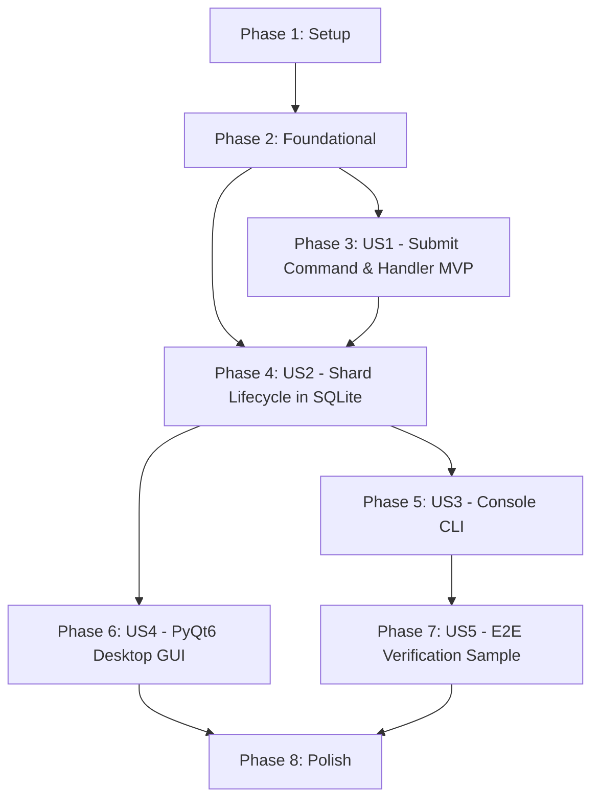

# Tasks: Training Client — Submit Training Application Command, Dual Presentation, and Shard Lifecycle

**Feature Branch**: `015-client-submit-training`  
**Date**: 2026-09-05  
**Spec**: [spec.md](file:///C:/Users/azure-dev/dev/TrainSwarm/specs/015-client-submit-training/spec.md)  
**Plan**: [plan.md](file:///C:/Users/azure-dev/dev/TrainSwarm/specs/015-client-submit-training/plan.md)  

---

## Phase 1: Setup (Shared Infrastructure)

**Purpose**: Initialize directory structure, packages, and dependency declarations for training submission, GUI, and testing.

- [X] T001 Update dependencies in src/Client/requirements.txt (torch>=2.2.0, safetensors) and create src/Client/requirements-gui.txt (PyQt6>=6.6.0)
- [X] T002 [P] Update src/Client/Dockerfile to declare volume /artifacts and configure environment variable TRAINING_CLIENT_WORKING_DIRECTORY=/artifacts
- [X] T003 [P] Create application package directory in src/Client/application/submit_training/__init__.py
- [X] T004 [P] Create presentation GUI package directory in src/Client/presentation/gui/__init__.py
- [X] T005 [P] Create test sample directory structure in samples/submit_training_test/

---

## Phase 2: Foundational (Blocking Prerequisites)

**Purpose**: Core domain status extensions, exceptions, and DTO contracts required across application and presentation layers.

**CRITICAL**: Foundational domain models and command DTOs must be defined before user story implementation begins.

- [X] T006 [P] Extend TrainingShardStatus enum with CREATED = "created" in src/Client/domain/training_shard.py
- [X] T007 [P] Define SubmitTrainingError, SubmitTrainingValidationError, and SubmitTrainingExecutionError in src/Client/application/submit_training/exceptions.py
- [X] T008 [P] Define SubmitTrainingResult DTO with serialization helpers in src/Client/application/submit_training/submit_training_result.py
- [X] T009 [P] Define SubmitTrainingCommand DTO with path, type, and training_config validation in src/Client/application/submit_training/submit_training_command.py

**Checkpoint**: Foundation ready — user story implementations can now proceed.

---

## Phase 3: User Story 1 - End-to-End Training Submission Orchestration (Priority: P1) ⭐ MVP

**Goal**: Implement `SubmitTrainingCommandHandler` to orchestrate model staging, smoke testing, dataset partitioning, local persistence as `CREATED`, and Coordinator task registration.

**Independent Test**: Supply valid `.pt2` checkpoint, `.pt` dataset, and training config JSON to `SubmitTrainingCommandHandler.handle()`; verify checkpoint staged into `{working_directory}/{model_id}/{model_id}_{model_version}.pt2`, smoke test runs and deletes temporary sample file, dataset is partitioned, shards saved to SQLite as `CREATED`, Coordinator called, and `SubmitTrainingResult` returned.

### Implementation for User Story 1

- [X] T010 [US1] Implement model checkpoint staging to {working_directory}/{model_id}/{model_id}_{model_version}.pt2 and training config JSON writing in src/Client/application/submit_training/submit_training_command_handler.py
- [X] T011 [US1] Implement representative sample extraction and smoke test dispatch with sample cleanup in src/Client/application/submit_training/submit_training_command_handler.py
- [X] T012 [US1] Implement dataset partitioning into {working_directory}/shards/{dataset_id}/ via PartitioningOrchestrator in src/Client/application/submit_training/submit_training_command_handler.py
- [X] T013 [US1] Implement shard persistence as CREATED, CoordinatorAdapter task registration, error handling, and result construction in src/Client/application/submit_training/submit_training_command_handler.py
- [X] T014 [US1] Expose public API and exports in src/Client/application/submit_training/__init__.py
- [X] T015 [US1] Wire SubmitTrainingCommandHandler into DIContainer in src/Client/dependency_injection/container.py

**Checkpoint**: User Story 1 complete. End-to-end training submission command can be executed programmatically via DIContainer.

---

## Phase 4: User Story 2 - Local Shard Lifecycle Management & Atomic Status Transitions (Priority: P2)

**Goal**: Extend `TrainingShardRepository` with atomic batch status updates to transition local shards from `CREATED` to `READY` upon Coordinator acknowledgement.

**Independent Test**: Bulk-save shards with status `CREATED`; call `TrainingShardRepository.update_status(shard_ids, TrainingShardStatus.READY)`; query SQLite to confirm all matching shards transitioned to `READY` within an atomic transaction.

### Implementation for User Story 2

- [X] T016 [US2] Define abstract update_status(shard_ids, status) method in ITrainingShardRepository in src/Client/infrastructure/persistence/training_shard_repository.py
- [X] T017 [US2] Implement atomic update_status method with BEGIN IMMEDIATE batch transaction in src/Client/infrastructure/persistence/training_shard_repository.py
- [X] T018 [US2] Update SubmitTrainingCommandHandler in src/Client/application/submit_training/submit_training_command_handler.py to call update_status to transition shards to READY upon successful Coordinator response

**Checkpoint**: User Stories 1 and 2 complete. Shards accurately track lifecycle transitions in SQLite with atomic safety.

---

## Phase 5: User Story 3 - Headless Console UI & Non-Interactive CLI Interface (Priority: P3)

**Goal**: Expose the `submit-training` subcommand via CLI argument flags with real-time progress logging and standard exit codes.

**Independent Test**: Run `python main.py submit-training --model-path <path> --dataset-path <path> --model-version v1.0 --model-type canonical_torch --training-config <config.json>`; verify argument parsing, progress logging, and exit code 0 on success or non-zero on failure.

### Implementation for User Story 3

- [X] T019 [US3] Implement argparse CLI argument parser for submit-training subcommand with validation in src/Client/presentation/console_ui.py
- [X] T020 [US3] Implement real-time progress logging, error formatting, and exit code handling in src/Client/presentation/console_ui.py
- [X] T021 [US3] Update main entry point in src/Client/main.py to parse CLI arguments and route submit-training to ConsoleUI

**Checkpoint**: User Stories 1 through 3 complete. Training tasks can be submitted via automated command-line scripts.

---

## Phase 6: User Story 4 - Modern Minimalist PyQt6 Desktop Graphical User Interface (Priority: P4)

**Goal**: Provide a clean, modern desktop GUI under `src/Client/presentation/gui/` with Submit Training and Logs tabs, form controls, and background `QThread` worker.

**Independent Test**: Launch `python main.py gui`; select model and dataset files via file dialogs, fill hyperparameter form, click Submit Training; verify form stays responsive, inline progress bar and status phase banner update during execution, and detailed logs stream to Logs tab.

### Implementation for User Story 4

- [X] T022 [P] [US4] Implement SubmitTrainingWorker as a QThread with signals (phase_changed, progress_updated, log_emitted, submission_succeeded, submission_failed) in src/Client/presentation/gui/worker.py
- [X] T023 [US4] Implement MainWindow with Submit Training tab (file pickers, dropdowns, hyperparameter spinboxes) and Logs tab in src/Client/presentation/gui/main_window.py
- [X] T024 [US4] Connect UI controls, inline progress bar, status phase banner, and background worker in src/Client/presentation/gui/main_window.py
- [X] T025 [US4] Update main entry point in src/Client/main.py with gui subcommand and headless display server guard

**Checkpoint**: User Stories 1 through 4 complete. Desktop users have an interactive visual interface decoupled from command execution.

---

## Phase 7: User Story 5 - Containerized End-to-End Verification Sample Suite & Multi-Path Matrix (Priority: P5)

**Goal**: Implement Docker environment management (`setup.py`, `clean.py`) and a 5-path test runner (`e2e-test.py`) validating the submission pipeline via `docker exec` against Client CLI.

**Independent Test**: Run `python setup.py` to start containers; run `python e2e-test.py` to execute test matrix covering happy path, corrupted model, invalid dataset, malformed config, and coordinator outage; verify 5/5 pass report; run `python clean.py` to verify full teardown.

### Implementation for User Story 5

- [X] T026 [P] [US5] Implement Docker network creation, container launching with volume mounts, and health check in samples/submit_training_test/setup.py
- [X] T027 [P] [US5] Implement container and test artifact teardown in samples/submit_training_test/clean.py
- [X] T028 [US5] Implement synthetic PyTorch 2 model and dataset generation helpers in samples/submit_training_test/e2e-test.py
- [X] T029 [US5] Implement 5-scenario test runner executing docker exec against Client CLI in samples/submit_training_test/e2e-test.py
- [X] T030 [US5] Implement pretty-printed console reporting table and exit code handling in samples/submit_training_test/e2e-test.py

**Checkpoint**: All user stories 1 through 5 complete. The complete feature is verified end-to-end in a real containerized environment.

---

## Phase 8: Polish & Cross-Cutting Concerns

**Purpose**: Final documentation updates, compilation verification, and quickstart validation.

- [X] T031 Update src/Client/README.md with CLI argument reference, GUI launch instructions, and Docker deployment notes
- [X] T032 [P] Validate syntax and compilation of all new and modified modules using python -m py_compile across src/Client and samples/submit_training_test/
- [X] T033 Execute quickstart validation suite in samples/submit_training_test/ per quickstart.md

---

## Dependencies & Execution Order

### Phase Dependencies

### User Story Dependencies

- **User Story 1 (P1)**: Depends on Foundational Phase (Phase 2). Delivers core application command and handler.
- **User Story 2 (P2)**: Integrates with US1. Adds atomic status update to repository and triggers it from handler.
- **User Story 3 (P3)**: Depends on US1 and US2. Exposes CLI flags in `ConsoleUI` and `main.py`.
- **User Story 4 (P4)**: Depends on US1 and US2. Builds PyQt6 GUI invoking `SubmitTrainingCommandHandler`.
- **User Story 5 (P5)**: Depends on US3 (requires functional Client CLI inside Docker container).

---

## Parallel Execution Opportunities

- Setup tasks `T002`, `T003`, `T004`, `T005` can run in parallel.
- Foundational tasks `T006`, `T007`, `T008`, `T009` can run in parallel.
- Phase 6 worker `T022` can be implemented in parallel with Phase 5 CLI tasks.
- Sample setup `T026` and cleanup `T027` can run in parallel.

---

## Implementation Strategy

### MVP First (User Stories 1 & 2)
1. Complete Phase 1 (Setup) and Phase 2 (Foundational).
2. Complete Phase 3 (US1: Command & Handler) and Phase 4 (US2: Shard Lifecycle).
3. Validate programmatic submission via python interactive session or unit invocation.

### Incremental Delivery
1. Add Phase 5 (US3: CLI) to enable automated terminal submissions.
2. Add Phase 6 (US4: Desktop GUI) to provide visual user interface.
3. Add Phase 7 (US5: Containerized E2E Test Suite) to prove full integration across real Docker services.
4. Complete Phase 8 (Polish & Documentation).
