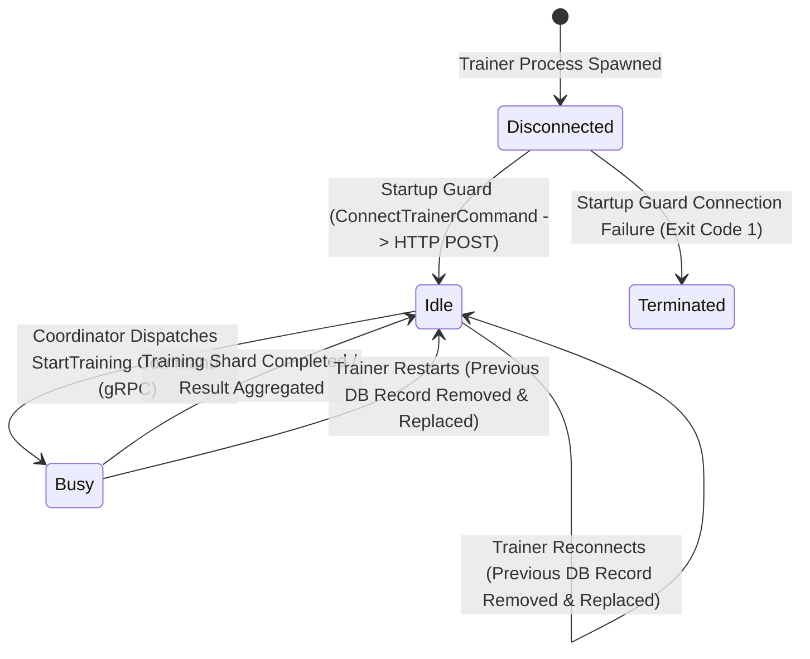

# Data Model: Trainer Connection

**Feature**: Trainer Connection (`016-trainer-connection`)  
**Status**: Completed  
**Date**: 2026-09-06  

This document describes all domain entities, DTOs, configuration models, and in-memory state models utilized across the Coordinator (.NET) and Trainer (Python) services for the Trainer Connection feature.

---

## 1. Coordinator Control Plane Models (.NET)

### 1.1 Domain Entity: `Trainer`
Represents a registered trainer node tracked in the Coordinator control plane.

- **Namespace**: `TrainSwarm.Coordinator.Domain.Entities`
- **File**: `src/Coordinator/TrainSwarm.Coordinator.Domain/Entities/Trainer.cs`

| Field | Type | Required | Default | Description |
| :--- | :--- | :---: | :--- | :--- |
| `Id` | `Guid` | Yes | Generated | Unique identifier for the trainer registration session (Primary Key). |
| `TrainerNodeId` | `string` | Yes | None | Logical node identifier assigned to the trainer instance. |
| `Status` | `TrainerStatus` | Yes | `TrainerStatus.IDLE` | Current operational availability status of the node. |

### 1.2 Domain Enum: `TrainerStatus`
Enumerates the operational states of a trainer node.

- **Namespace**: `TrainSwarm.Coordinator.Domain.Entities`
- **File**: `src/Coordinator/TrainSwarm.Coordinator.Domain/Entities/TrainerStatus.cs`

| Enum Value | Integer Value | Description |
| :--- | :---: | :--- |
| `UNCLEAR` | `0` | Default/unverified status before health or state confirmation. |
| `IDLE` | `1` | Trainer is connected, healthy, and available for training tasks. |
| `BUSY` | `2` | Trainer is actively executing an assigned training workload. |

### 1.3 Database Configuration: `TrainerConfiguration`
EF Core Fluent API mapping for the SQLite database.

- **Namespace**: `TrainSwarm.Coordinator.Infrastructure.Persistence.Configurations`
- **File**: `src/Coordinator/TrainSwarm.Coordinator.Infrastructure/Persistence/Configurations/TrainerConfiguration.cs`
- **Table Name**: `Trainers`
- **Key**: `Id`
- **Properties**:
  - `TrainerNodeId`: `HasMaxLength(128)`, `IsRequired()`
  - `Status`: `IsRequired()`, stored as Integer

### 1.4 Application DTOs: `ConnectTrainerDto` & `ConnectTrainerResult`
Data transfer objects crossing the Web API and Application Service boundaries.

- **`ConnectTrainerDto`**:
  - **Namespace**: `TrainSwarm.Coordinator.Application.Services`
  - **Properties**: `string TrainerNodeId`
  - **Validation**: Cannot be null, empty, or pure whitespace.
- **`ConnectTrainerResult`**:
  - **Namespace**: `TrainSwarm.Coordinator.Application.Services`
  - **Properties**:
    - `Guid Id`: Newly assigned registration GUID.
    - `string TrainerNodeId`: Normalized node ID.
    - `TrainerStatus Status`: Assigned status (`TrainerStatus.IDLE`).
- **`ConnectTrainerResponseDto`**:
  - **Namespace**: `TrainSwarm.Coordinator.Api.Controllers`
  - **Properties**:
    - `string Id`: String representation of the GUID.
    - `string TrainerNodeId`: Registered node ID.
    - `string Status`: Status string (`"IDLE"`).

---

## 2. Trainer Data Plane Models (Python)

### 2.1 Configuration Model: `TrainerConfig`
Immutable configuration container constructed and validated by `ConfigManager`.

- **Module**: `src/Trainer/config/models.py`

| Attribute | Type | Environment Variable | Default | Description |
| :--- | :--- | :--- | :--- | :--- |
| `coordinator_address` | `str` | `COORDINATOR_ADDRESS` / `COORDINATOR_URL` | None (Required) | Base HTTP URL of the Coordinator REST API. |
| `coordinator_grpc_address` | `str` | `COORDINATOR_GRPC_ADDRESS` / `COORDINATOR_GRPC_URL` | `localhost:5000` | Host and port for Coordinator gRPC command streaming. |
| `trainer_node_id` | `str` | `TRAINER_NODE_ID` | `trainer-node-01` | Configured node identifier name. |
| `request_timeout_seconds` | `float` | `REQUEST_TIMEOUT_SECONDS` | `10.0` | HTTP request and socket timeout limit. |
| `working_directory` | `Path` | `TRAINER_WORKING_DIRECTORY` | `/artifacts` or `.` | Root directory for artifacts and execution. |

### 2.2 In-Memory Application State: `TrainerState`
Authoritative in-memory state tracking runtime status and identity.

- **Module**: `src/Trainer/application/state.py`

| Property | Type | Default Value | Description |
| :--- | :--- | :--- | :--- |
| `client_node_id` | `str` | `"trainer-node-01"` | Hardcoded node identifier string constant sent to Coordinator. |
| `is_connected` | `bool` | `False` | Flag indicating whether the node successfully completed startup registration. |
| `current_status` | `str` | `"INITIALIZED"` | Local node lifecycle state (`INITIALIZED`, `IDLE`, `BUSY`, `DISCONNECTED`). |
| `assigned_tasks` | `List[str]` | `[]` | List of task or session identifiers currently assigned to this node. |

### 2.3 Adapter Result: `CoordinatorAdapterResult`
Transport-agnostic result model returned by `CoordinatorAdapter`.

- **Module**: `src/Trainer/infrastructure/adapters/coordinator_adapter.py`

| Attribute | Type | Description |
| :--- | :--- | :--- |
| `success` | `bool` | `True` if HTTP status 200/201 was returned and JSON parsed successfully; `False` otherwise. |
| `description` | `str` | Human-readable outcome description or diagnostic failure reason. |
| `trainer_id` | `Optional[str]` | GUID string returned by Coordinator upon successful registration, or `None`. |
| `status_code` | `Optional[int]` | HTTP status code received from Coordinator (if network connection was made). |

### 2.4 Command Models

#### `ConnectTrainerCommand` & `ConnectTrainerResult`
- **Module**: `src/Trainer/application/trainer_commands/connect_trainer/connect_trainer_command.py`
- **Properties**: No input properties (reads node identity from `TrainerState`).
- **Result**: `ConnectTrainerResult` wrapping `success: bool`, `description: str`, `trainer_id: Optional[str]`.

#### `StartTrainingCommand` & `CommandEnvelope`
- **Module**: `src/Trainer/application/coordinator_commands/start_training/command.py`
- **Properties**:
  - `training_client_node_id: str`: Client node that scheduled the session.
  - `session_id: str`: Unique session UUID string.
- **Envelope (`CommandEnvelope`)**:
  - `id: str`: Message UUID.
  - `type: str`: Command type string (`"StartTraining"`).
  - `data: str`: UTF-8 JSON payload string.

---

## 3. Entity State Transitions

