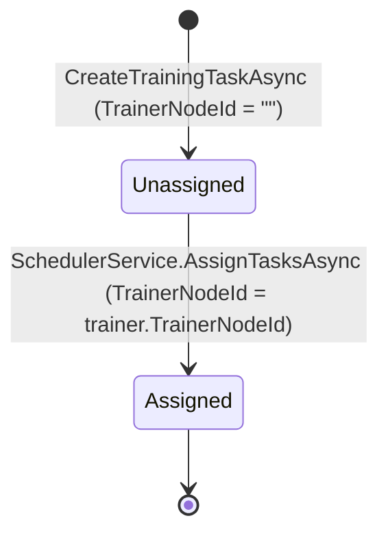
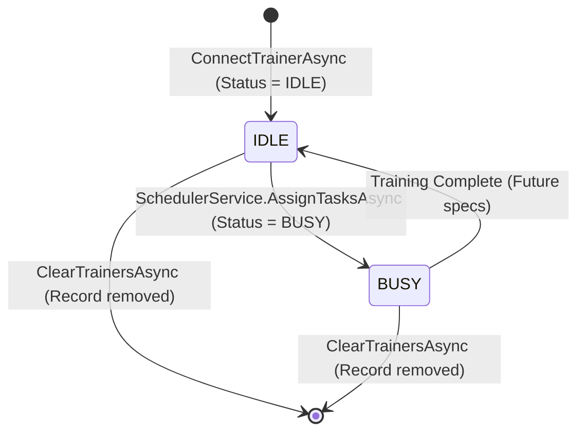

# Data Model: Fair Model-Level Round-Robin Coordinator Scheduler

## Entities

### 1. TrainingTask (`TrainSwarm.Coordinator.Domain.Entities.TrainingTask`)

Represents a computational training task submitted for execution.

| Field | Type | Required | Default | Description |
|---|---|---|---|---|
| `TrainingTaskId` | `Guid` | Yes | Generated | Primary Key |
| `ClientNodeId` | `string` | Yes | None | Identifier of submitting client |
| `ModelId` | `string` | Yes | None | Model identifier (used for logical queue grouping) |
| `ModelVersion` | `string` | Yes | None | Version identifier of the model |
| `DataSetId` | `string` | Yes | None | Dataset identifier |
| `ShardId` | `string` | Yes | None | Dataset shard partition identifier |
| `TrainerNodeId` | `string` | Yes | `string.Empty` | Assigned trainer node identifier (empty if unassigned) |
| `SubmitTime` | `DateTime` | Yes | `DateTime.Now` | Timestamp when task was created |

#### Persistence Details (EF Core)
- **Table**: `TrainingTasks`
- **Key**: `TrainingTaskId`
- **Indices / Queries**:
  - Unassigned query filter: `string.IsNullOrEmpty(t.TrainerNodeId)`
  - Grouping: `ModelId`
  - Sorting: `SubmitTime ASC`, `TrainingTaskId ASC`

---

### 2. Trainer (`TrainSwarm.Coordinator.Domain.Entities.Trainer`)

Represents an execution worker registered in the control plane.

| Field | Type | Required | Default | Description |
|---|---|---|---|---|
| `Id` | `Guid` | Yes | Generated | Primary Key |
| `TrainerNodeId` | `string` | Yes | None | Identifier of the trainer node |
| `Status` | `TrainerStatus` | Yes | `TrainerStatus.IDLE` | Availability status enum |

#### TrainerStatus Enum
```csharp
public enum TrainerStatus
{
    UNCLEAR = 0,
    IDLE = 1,
    BUSY = 2
}
```

- **IDLE (1)**: Eligible to receive task assignments.
- **BUSY (2)**: Actively executing a training workload; ineligible for scheduling.
- **UNCLEAR (0)**: Node state unknown or unverified; ineligible for scheduling.

---

## In-Memory Models & State

### 3. SchedulerCursorState (`TrainSwarm.Coordinator.Application.Services.ISchedulerCursorState`)

Thread-safe in-memory singleton preserving the round-robin cursor across HTTP request invocations.

| Property / Method | Type / Signature | Description |
|---|---|---|
| `GetCurrentCursor()` | `string?` | Returns the model identifier currently holding the scheduling cursor |
| `SetCurrentCursor(string? modelId)` | `void` | Updates the cursor to the next model identifier |
| `Reset()` | `void` | Resets cursor to `null` (pristine initial state) |

---

## Data Transfer Objects (DTOs)

### 4. AssignedTaskDto (`TrainSwarm.Coordinator.Application.Services.AssignedTaskDto`)

Returned directly in the response body of `POST /api/scheduler/assign`.

```json
[
  {
    "trainingTaskId": "3fa85f64-5717-4562-b3fc-2c963f66afa6",
    "modelId": "model-resnet50",
    "trainerNodeId": "trainer-node-01",
    "shardId": "shard-001",
    "submitTime": "2026-09-07T21:40:00.000Z"
  }
]
```

| Field | Type | Description |
|---|---|---|
| `trainingTaskId` | `string` (UUID) | Assigned task identifier |
| `modelId` | `string` | Model identifier |
| `trainerNodeId` | `string` | Assigned trainer node identifier |
| `shardId` | `string` | Shard identifier |
| `submitTime` | `string` (ISO 8601) | Creation timestamp |

---

## State Transitions

### Task State Transition


### Trainer State Transition


---

## Validation & Ordering Invariants

1. **Task Eligibility Rule**:
   `string.IsNullOrEmpty(task.TrainerNodeId)` is strictly required. Tasks with non-empty `TrainerNodeId` are never considered.
2. **Trainer Eligibility Rule**:
   `trainer.Status == TrainerStatus.IDLE` is strictly required. Statuses `BUSY` and `UNCLEAR` are never selected.
3. **Queue Grouping & Model Ordering**:
   Tasks are grouped by `ModelId`. Within each model queue:
   `SubmitTime ASC`, then `TrainingTaskId ASC`.
4. **Trainer Selection Determinism**:
   Eligible idle trainers are sorted by `TrainerNodeId ASC`.
5. **Round-Robin Cursor Advancing**:
   The cursor advances to the next active model after each task selection. Exhausted models are pruned from the active rotation.
