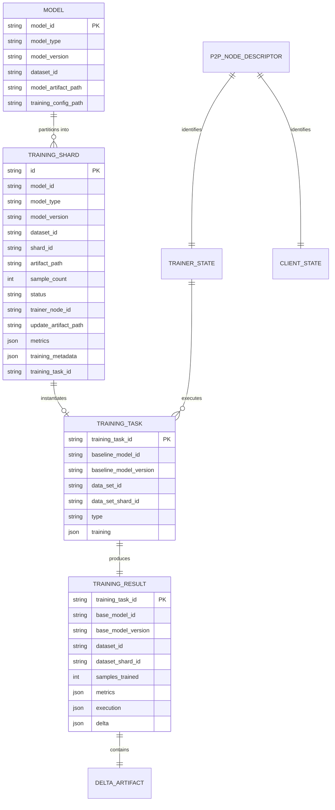

# Data Model Specification: Distributed File Transfer and P2P Training Execution

**Feature**: `019-distributed-file-transfer` | **Phase**: 1 | **Date**: 2026-09-08

## Entity Overview & Relationships



---

## 1. Domain Entities & Persistence Models

### 1.1 `Model` (Client Domain & SQLite Table `models`)
Represents top-level metadata for a registered model submission.

| Field | Type | Nullable | Validation / Description |
|---|---|:---:|---|
| `model_id` | `TEXT` (UUID) | No | Primary Key. Valid UUID string uniquely identifying model. |
| `model_type` | `TEXT` | No | Architecture type (e.g. `TorchCanonicalModelAdapter`). |
| `model_version` | `TEXT` | No | Semantic or sequential version identifier (e.g. `1.0.0`). |
| `dataset_id` | `TEXT` (UUID) | No | Identifier of the partitioned dataset associated with this model. |
| `model_artifact_path` | `TEXT` | No | Absolute filesystem path to the model checkpoint (`.pt2`). |
| `training_config_path` | `TEXT` | No | Absolute filesystem path to the training configuration JSON file. |

**Indexes**:
- `PRIMARY KEY (model_id)`
- `INDEX ix_models_dataset_id (dataset_id)`

---

### 1.2 `TrainingShard` (Client Domain & SQLite Table `training_shards`)
Tracks the lifecycle, assignment, and delta update location of each dataset partition.

| Field | Type | Nullable | Validation / Description |
|---|---|:---:|---|
| `id` | `TEXT` (UUID) | No | Primary Key. Unique record identifier. |
| `model_id` | `TEXT` | No | Parent model identifier. |
| `model_type` | `TEXT` | No | Distributed training engine model adapter identifier. |
| `model_version` | `TEXT` | No | Target model version for training. |
| `dataset_id` | `TEXT` | No | Dataset identifier. |
| `shard_id` | `TEXT` | No | Logical partition index / ID (e.g. `shard_000`). |
| `artifact_path` | `TEXT` | No | Local filesystem path to the dataset partition (`.pt`). |
| `sample_count` | `INTEGER` | No | Count of samples in this shard, must be $> 0$. |
| `status` | `TEXT` | No | Status enum: `created`, `ready`, `training`, `completed`, `failed`. |
| `trainer_node_id` | `TEXT` | Yes | Libp2p peer ID of the assigned trainer currently executing the task. |
| `update_artifact_path` | `TEXT` | Yes | Local filesystem path to the received delta update (`.safetensors`). |
| `metrics` | `TEXT` (JSON) | Yes | Serialized JSON dictionary of training metrics (loss, duration, etc.). |
| `training_metadata` | `TEXT` (JSON) | Yes | Serialized JSON dictionary of execution telemetry. |
| `training_task_id` | `TEXT` | Yes | Identifier of the training task instance. |

**Constraints & Indexes**:
- `PRIMARY KEY (id)`
- `UNIQUE INDEX uq_training_shards_logical_shard (model_id, model_version, dataset_id, shard_id)`
- `CHECK (sample_count > 0)`

**State Transitions**:
```text
[CREATED] ──(submit)──> [READY] ──(get_training_task)──> [TRAINING] ──(update_model)──> [COMPLETED]
                                                              │
                                                              └──(failure/timeout)──> [FAILED]
```
*Note per Clarification Q1*: If a shard is already in `TRAINING` or `COMPLETED` status and a trainer requests it via `get_training_task`, Client unconditionally overwrites `trainer_node_id` and resets status to `TRAINING`.

---

### 1.3 `TrainingTask` (Distributed Training Engine DTO)
Portable task specification serialized as JSON between Client and Trainer over P2P.

| Field | Type | Validation / Description |
|---|---|---|
| `training_task_id` | `string` | Unique identifier generated for this task execution. |
| `baseline_model_id` | `string` | Target model identifier. |
| `baseline_model_version` | `string` | Target model version string. |
| `data_set_id` | `string` | Dataset identifier. |
| `data_set_shard_id` | `string` | Specific partition identifier assigned to trainer. |
| `type` | `string` | Training engine adapter type (e.g. `TorchCanonicalModelAdapter`). |
| `training` | `dict` | Training hyperparameters (learning rate, batch size, epochs, optimizer). |

---

### 1.4 `TrainingResult` (Distributed Training Engine DTO)
Completed task report returned by `TrainingOrchestrator` on Trainer and transmitted to Client.

| Field | Type | Description |
|---|---|---|
| `training_task_id` | `string` | Corresponds to executed task identifier. |
| `base_model_id` | `string` | Base model identifier. |
| `base_model_version` | `string` | Base model version. |
| `dataset_id` | `string` | Dataset identifier. |
| `dataset_shard_id` | `string` | Shard identifier trained against. |
| `samples_trained` | `int` | Count of processed training samples. |
| `metrics` | `dict` | Training evaluation metrics (e.g. `final_loss`, `loss_history`). |
| `execution` | `ExecutionInfo` | Timing metrics (`started_at`, `completed_at`, `duration_ms`). |
| `delta` | `DeltaArtifactInfo` | Metadata on generated safetensors file (`filename`, `path`, `size_bytes`, `tensor_count`). |

---

## 2. In-Memory Runtime State Models

### 2.1 `TrainerState` (`Trainer/application/state.py`)
Authoritative thread-safe state machine for Trainer application.

| Attribute | Type | Default | Description |
|---|---|---|---|
| `_client_node_id` | `str` | `"trainer-node-01"` | Default fallback / configured node ID. |
| `_p2p_node_id` | `Optional[str]` | `None` | Verified libp2p peer ID retrieved from local `p2p-node`. |
| `_is_connected` | `bool` | `False` | Coordinator connection status flag. |
| `_trainer_id` | `Optional[str]` | `None` | Registration session GUID assigned by Coordinator. |
| `_current_status` | `str` | `"INITIALIZED"` | Operational status (`IDLE`, `BUSY`, `TRAINING`, `DISCONNECTED`). |
| `_assigned_tasks` | `List[str]` | `[]` | List of active assigned task/shard IDs. |
| `_is_training` | `bool` | `False` | Real-time flag indicating active training execution (toggled by `StartTrainingHandler`). |

---

### 2.2 `ClientState` (`Client/application/state.py`)
Authoritative thread-safe state machine for Client application.

| Attribute | Type | Default | Description |
|---|---|---|---|
| `_client_node_id` | `str` | `""` | Configured or retrieved node ID. |
| `_p2p_node_id` | `Optional[str]` | `None` | Verified libp2p peer ID retrieved from local `p2p-node`. |
| `_active_sessions` | `List[str]` | `[]` | Active training sessions. |

---

## 3. P2P Node Runtime Descriptor (`P2PNodeDescriptor`)
Returned by `p2p-node` over gRPC `GetNodeInfo`.

| Field | Type | Description |
|---|---|---|
| `peer_id` | `string` | Libp2p Base58/Multihash peer identifier. |
| `listen_addresses` | `List[string]` | Local listening multiaddresses (e.g. `/ip4/0.0.0.0/tcp/9000`). |
| `relay_addresses` | `List[string]` | Active relay multiaddresses via Bootstrap Relay. |
| `reachability` | `Reachability` | Reachability status enum (`PUBLIC`, `PRIVATE`, `RELAY_ONLY`, `UNKNOWN`). |
| `grpc_api_version` | `string` | API version string (e.g. `"v1"`). |
