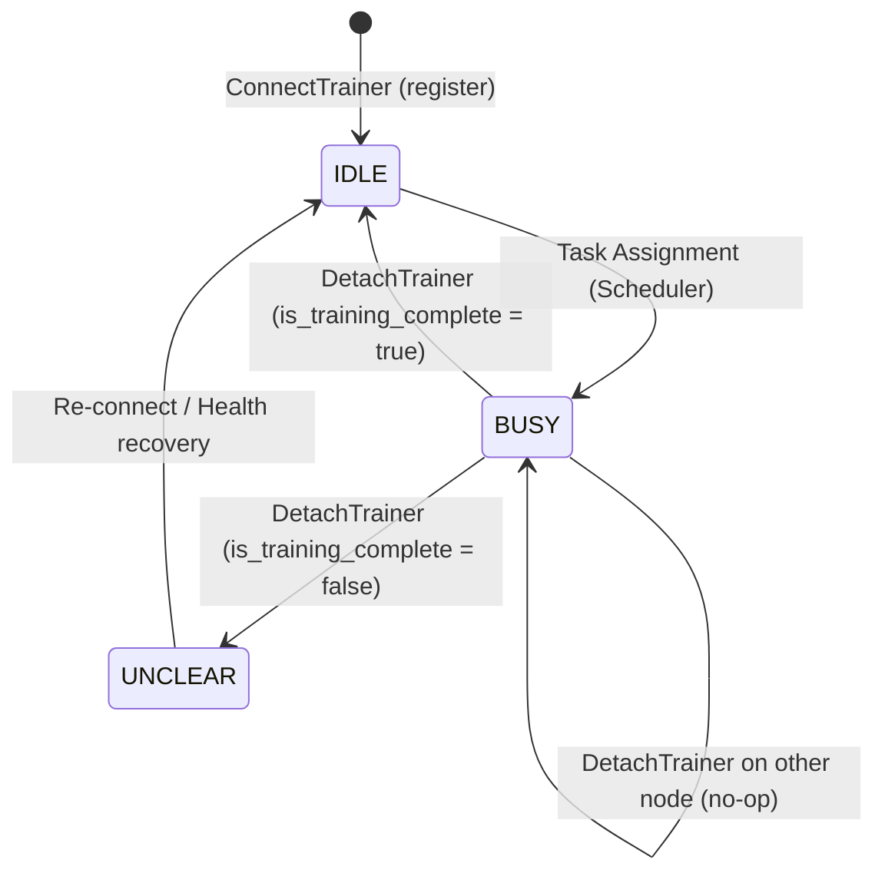
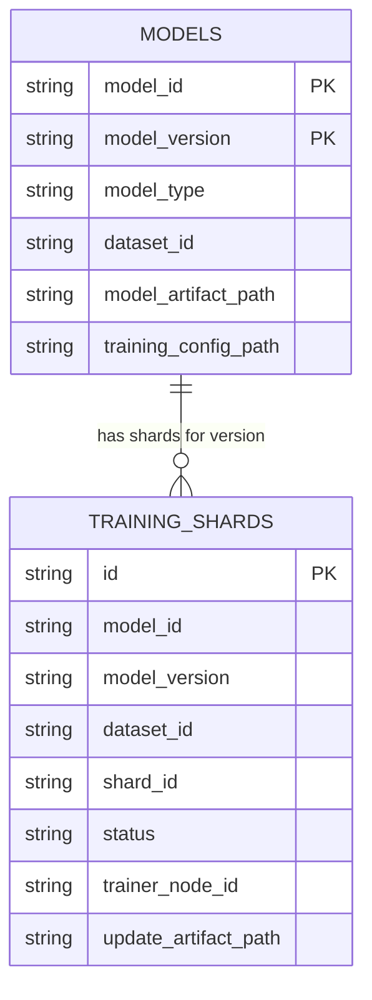
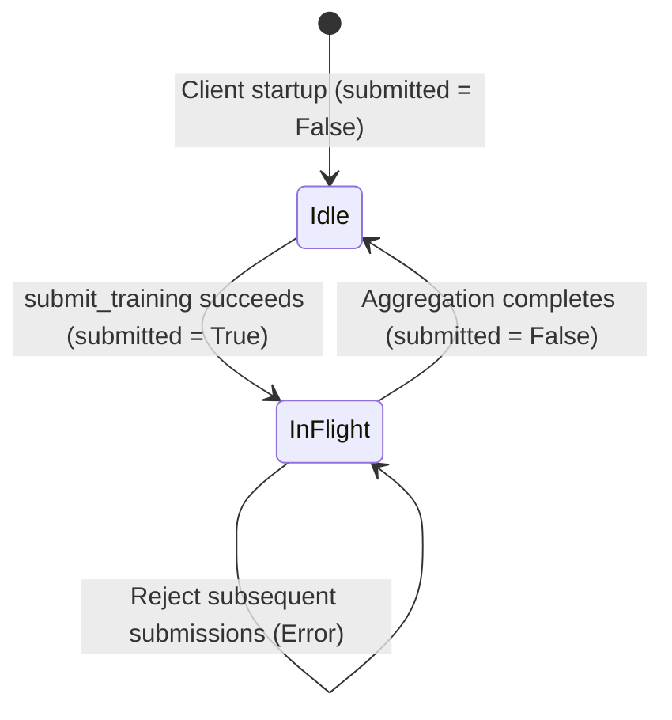

# Data Model: Model Update Follow-up & Distributed Aggregation Lifecycle

**Feature**: `020-update-model-followup`  
**Date**: 2026-09-13  
**Status**: Completed  

---

## 1. Domain Entities & Schemas

### 1.1 Coordinator: `Trainer` Entity & Status Transitions



#### EF Core Schema: `Trainers` Table
| Column | Type | Nullable | Primary Key | Description |
|---|---|---|---|---|
| `Id` | `Guid` | No | Yes | Unique trainer record identifier |
| `TrainerNodeId` | `string` | No | No | Logical node ID (e.g. `trainer-node-1`) |
| `Status` | `TrainerStatus` | No | No | `0 = UNCLEAR`, `1 = IDLE`, `2 = BUSY` |

#### DTO: `DetachTrainerRequest` / `DetachTrainerDto`
| Field | Type | Required | Description |
|---|---|---|---|
| `TrainerNodeId` | `string` | Yes | Node identifier of the trainer to detach |
| `IsTrainingComplete` | `bool` | Yes | `true` if training completed successfully, `false` if failed |

---

### 1.2 Client: `Model` Entity & Multi-Version Persistence



#### SQLite Schema: `models` Table
| Column | SQLite Type | Constraints | Description |
|---|---|---|---|
| `model_id` | `TEXT` | `NOT NULL` | Base UUID identifier for the model |
| `model_version` | `TEXT` | `NOT NULL` | Version string (e.g., `"1"`, `"2"`) |
| `model_type` | `TEXT` | `NOT NULL` | Model architecture enum (e.g. `canonical_torch`) |
| `dataset_id` | `TEXT` | `NOT NULL` | Associated training dataset identifier |
| `model_artifact_path` | `TEXT` | `NOT NULL` | Absolute filesystem path to `.pt2` checkpoint |
| `training_config_path` | `TEXT` | `NOT NULL` | Absolute filesystem path to configuration JSON |
| **PRIMARY KEY** | - | `(model_id, model_version)` | Composite key supporting version history |

#### Python Domain Entity: `Model`
```python
@dataclass
class Model:
    model_id: str
    model_type: str
    model_version: str
    dataset_id: str
    model_artifact_path: str
    training_config_path: str
```

---

### 1.3 Client: In-Memory `ClientState` & Submission Guard



#### State Fields in `ClientNode` / `ClientState`
| Property | Type | Default | Mutated By | Description |
|---|---|---|---|---|
| `submitted` | `bool` | `False` | `SubmitTrainingCommandHandler` (`True`), `UpdateModelCommandHandler` (`False`) | Guard preventing overlapping training submissions |

---

### 1.4 Client: Application Query DTOs

#### `TrainingShardViewDto`
| Field | Type | Description |
|---|---|---|
| `model_id` | `str` | Model identifier |
| `model_version` | `str` | Active version of the model being trained |
| `dataset_id` | `str` | Dataset partition group identifier |
| `shard_id` | `str` | Shard partition identifier (e.g. `shard_0`) |
| `status` | `str` | Shard status (`created`, `ready`, `training`, `completed`, `failed`) |
| `trainer_node_id` | `Optional[str]` | Trainer node assigned to the shard |
| `update_artifact_path` | `Optional[str]` | Local path to trainer's update delta safetensors |

#### `TrainedModelViewDto`
| Field | Type | Description |
|---|---|---|
| `model_id` | `str` | Model identifier |
| `model_version` | `str` | Trained model version number |
| `model_type` | `str` | Engine model type (e.g. `canonical_torch`) |
| `dataset_id` | `str` | Dataset ID used in training |
| `artifact_path` | `str` | Absolute path to checkpoint file (`.pt2`) |
| `training_config_path` | `str` | Path to hyperparameters config |

---

### 1.5 Aggregation Payload: `AggregationRequest`

Used by `UpdateModelCommandHandler` when invoking `AggregationOrchestrator`:
```python
AggregationRequest(
    modelId=model_id,                           # e.g. "model-uuid-1234"
    baseModelVersion=int(model_version),        # e.g. 1
    baseModelPath=base_model_checkpoint_path,   # e.g. "C:/.../v1/checkpoint.pt2"
    newVersion=int(model_version) + 1,          # e.g. 2
    newVersionOutputDirectory=output_directory, # e.g. "C:/.../v2/"
    updates=[
        ModelUpdate(samplesTrained=25, deltaPath="C:/.../shard_0_update.safetensors"),
        ModelUpdate(samplesTrained=25, deltaPath="C:/.../shard_1_update.safetensors"),
    ]
)
```
