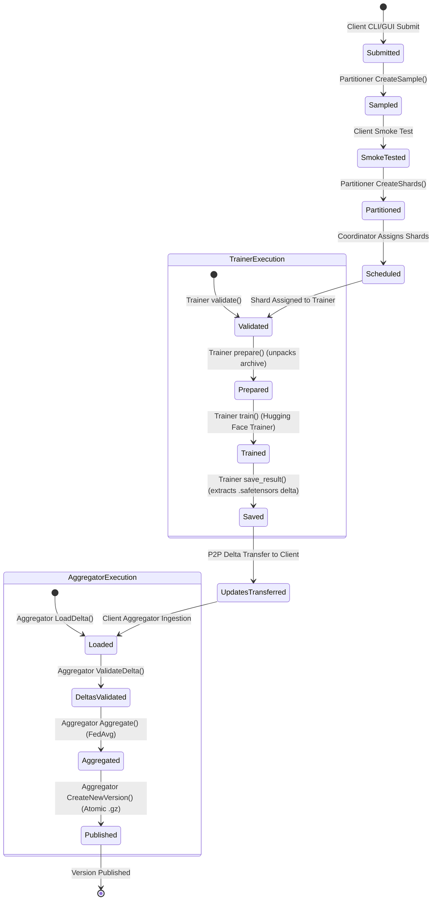

# Phase 1 Data Model: Canonical Causal Decoder Model

**Feature Branch**: `021-canonical-causal-decoder`  
**Date**: 2026-09-13  
**Status**: Completed  

---

## 1. Domain Entities & Schemas

### 1.1 `CanonicalCausalDecoderTrainingConfig`
Strongly typed configuration entity deserialized from the JSON training parameters within a `TrainingTask`.

| Field Name | Type | Default | Validation / Constraints | Description |
| :--- | :--- | :--- | :--- | :--- |
| `seed` | `int` | `42` | `seed >= 0` | Random seed for reproducible dataset shuffling and weight initialization. |
| `batch_size` | `int` | `2` | `batch_size >= 1` | Per-device training batch size for forward/backward passes. |
| `epochs` | `int` | `1` | `epochs >= 1` | Number of complete passes over the assigned shard. |
| `max_steps` | `Optional[int]` | `None` | `max_steps is None or max_steps >= 1` | Maximum optimizer update steps; overrides epoch-based termination when set. |
| `learning_rate` | `float` | `5e-5` | `learning_rate > 0.0` | Initial learning rate used by the optimizer (AdamW). |
| `weight_decay` | `float` | `0.01` | `weight_decay >= 0.0` | Weight decay coefficient (L2 penalty) for optimizer. |
| `gradient_accumulation_steps` | `int` | `1` | `gradient_accumulation_steps >= 1` | Number of forward/backward batches accumulated before an optimizer step. |
| `max_grad_norm` | `Optional[float]` | `1.0` | `max_grad_norm is None or max_grad_norm > 0.0` | Maximum gradient norm for gradient clipping; `None` disables clipping. |
| `scheduler_type` | `str` | `"linear"` | Must be valid HF scheduler (`linear`, `cosine`, `constant`, etc.) | Learning rate decay scheduler strategy. |
| `warmup_steps` | `int` | `0` | `warmup_steps >= 0` | Linear warmup steps at the start of training. |
| `warmup_ratio` | `float` | `0.0` | `0.0 <= warmup_ratio <= 1.0` | Fraction of total steps used for warmup (alternative to `warmup_steps`). |
| `fp16` | `bool` | `False` | Boolean flag | Enables 16-bit floating-point mixed-precision on CUDA. |
| `bf16` | `bool` | `False` | Boolean flag | Enables bfloat16 mixed-precision on supported hardware. |
| `shuffle` | `bool` | `True` | Boolean flag | Whether to shuffle the dataset shard between epochs. |

---

### 1.2 `CanonicalCausalDecoderModelArchive`
Physical model artifact format stored as a compressed `.gz` or `.tar.gz` archive.

```text
<archive_name>.gz
├── model/
│   ├── config.json                     # Hugging Face model architecture config
│   ├── model.safetensors               # Transformer weights (or pytorch_model.bin)
│   └── generation_config.json          # Optional generation parameters
└── tokenizer/
    ├── tokenizer_config.json           # Tokenizer settings & special tokens
    ├── vocab.json / vocab.txt          # Vocabulary definitions
    ├── merges.txt                      # BPE merges (if applicable)
    └── tokenizer.json                  # Fast tokenizer definitions
```

**Validation Rules**:
- Archive must decompress cleanly using `tarfile` in `"r:gz"` mode.
- Must contain top-level directories named `model/` (or `./model/`) and `tokenizer/` (or `./tokenizer/`).
- `model/` must contain valid Hugging Face files loadable via `AutoModelForCausalLM.from_pretrained()`.
- `tokenizer/` must contain valid Hugging Face files loadable via `AutoTokenizer.from_pretrained()`.

---

### 1.3 `CanonicalCausalDecoderDataset`
Tokenized dataset format saved as a PyTorch file (`.pt`).

```python
{
    "input_ids": torch.LongTensor,       # Shape: [N, seq_len]
    "attention_mask": torch.LongTensor,  # Shape: [N, seq_len]
    "labels": torch.LongTensor           # Shape: [N, seq_len]
}
```

**Validation Rules**:
- The deserialized object must be a `dict`.
- Must contain exactly keys `"input_ids"`, `"attention_mask"`, and `"labels"`.
- All three values must be 2D `torch.Tensor` instances with dtype `torch.long` (or `torch.int64`).
- First dimension $N$ (sample count) must match across all three tensors ($N \ge 1$).
- Second dimension (sequence length) must match across all three tensors.
- Shards sliced from this dataset preserve the exact key schema, dtypes, and token sequences.

---

### 1.4 `CanonicalCausalDecoderDelta`
Parameter update artifact serialized via `safetensors.torch.save_file` after local training.

```text
<base_model_id>_<version>_<dataset_id>_<shard_id>.safetensors
```

**Content**:
Mapping from parameter name to tensor delta:
$$\Delta W_p = W_{\text{trained}, p} - W_{\text{base}, p}$$

**Validation Rules**:
- Every parameter in the delta must correspond to a trainable parameter (`requires_grad=True`) in the base model.
- Parameter tensor shape must match $W_{\text{base}, p}$.
- Parameter tensor dtype must match $W_{\text{base}, p}$.
- Delta file must not contain extraneous non-parameter keys.

---

### 1.5 `ModelType`
System enumeration updated to include the new adapter identifier.

```python
class ModelType(str, Enum):
    CANONICAL_TORCH = "canonical_torch"
    CANONICAL_CAUSAL_DECODER = "canonical_causal_decoder"
```

---

## 2. State Lifecycle & Transitions


