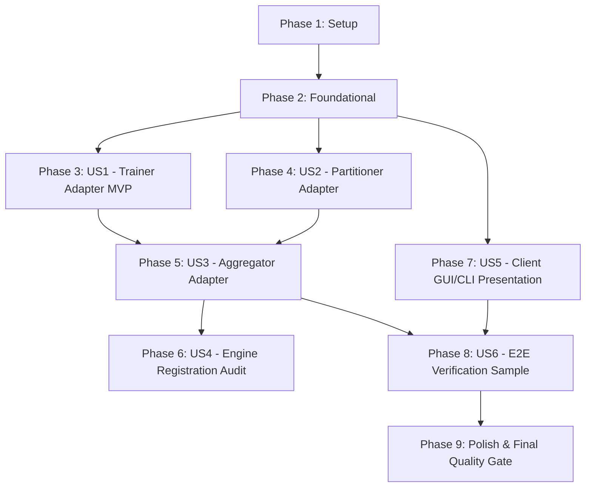

# Tasks: Canonical Causal Decoder Model

**Branch**: `021-canonical-causal-decoder`  
**Spec**: [spec.md](./spec.md) | **Plan**: [plan.md](./plan.md)  
**Status**: Ready for Implementation  

---

## Phase 1: Setup (Shared Infrastructure & Engine Constants)

**Purpose**: Establish adapter suite package layout and engine model type identifier.

- [X] T001 Create adapter directory structure `src/distributed_training_engine/adapters/canonical_causal_decoder/` with `training/`, `partitioning/`, `aggregation/` packages and `__init__.py` files
- [X] T002 Add `CANONICAL_CAUSAL_DECODER = "canonical_causal_decoder"` to `ModelType` enum in `src/distributed_training_engine/model_type.py`
- [X] T003 [P] Implement `CanonicalCausalDecoderTrainingConfig` dataclass with type validation and defaults in `src/distributed_training_engine/adapters/canonical_causal_decoder/training/canonical_causal_decoder_config.py`

---

## Phase 2: Foundational (Adapter Registry Integration)

**Purpose**: Wire adapter classes into engine registries to enable dynamic resolution.

**⚠️ CRITICAL**: Foundational tasks must be completed before user story workflows can resolve adapters.

- [X] T004 Register `CANONICAL_CAUSAL_DECODER` adapter resolution in `src/distributed_training_engine/training/trainer_adapter_registery.py`
- [X] T005 [P] Register `CANONICAL_CAUSAL_DECODER` adapter resolution in `src/distributed_training_engine/partitioning/partitioner_adapter_registery.py`
- [X] T006 [P] Register `CANONICAL_CAUSAL_DECODER` adapter resolution in `src/distributed_training_engine/aggregation/aggregator_adapter_registery.py`

**Checkpoint**: Foundation ready - adapter registration points and configuration schemas established.

---

## Phase 3: User Story 1 - Local Training Execution with Hugging Face Causal LM (Priority: P1) 🎯 MVP

**Goal**: Enable Trainer nodes to unpack model archives, load causal LM transformer models and tokenizers, fine-tune using Hugging Face `Trainer`, compute parameter deltas ($\Delta W = W_{\text{trained}} - W_{\text{base}}$), and serialize them to `.safetensors`.

**Independent Test**: Load a valid compressed causal decoder model archive (`.gz`) containing model and tokenizer weights, an assigned `.pt` dataset shard with `input_ids`, `attention_mask`, and `labels`, and a `CanonicalCausalDecoderTrainingConfig`. Run the 4-phase lifecycle (`validate()`, `prepare()`, `train()`, `save_result()`). Verify fine-tuning completes, baseline parameters remain unmodified, and a `.safetensors` delta file is saved alongside a populated `TrainingResult`.

### Implementation for User Story 1

- [X] T007 [P] [US1] Implement archive extraction to `model_unpacked/`, envelope checks, and artifact verification in `validate()` in `src/distributed_training_engine/adapters/canonical_causal_decoder/training/canonical_causal_decoder_trainer.py`
- [X] T008 [US1] Implement device resolution, model/tokenizer loading, dataset schema verification (`input_ids`, `attention_mask`, `labels`), immutable baseline snapshotting, and Hugging Face `Trainer` initialization in `prepare()` in `src/distributed_training_engine/adapters/canonical_causal_decoder/training/canonical_causal_decoder_trainer.py`
- [X] T009 [US1] Implement fine-tuning execution and metrics tracking via `hf_trainer.train()` in `train()` in `src/distributed_training_engine/adapters/canonical_causal_decoder/training/canonical_causal_decoder_trainer.py`
- [X] T010 [US1] Implement parameter delta calculation ($\Delta W = W_{\text{trained}} - W_{\text{base}}$) and `.safetensors` update serialization in `save_result()` in `src/distributed_training_engine/adapters/canonical_causal_decoder/training/canonical_causal_decoder_trainer.py`
- [X] T011 [US1] Export `CanonicalCausalDecoderTrainer` and `CanonicalCausalDecoderTrainingConfig` in `src/distributed_training_engine/adapters/canonical_causal_decoder/training/__init__.py`

**Checkpoint**: User Story 1 functional - Trainer nodes can locally fine-tune Hugging Face causal LM models and generate parameter updates.

---

## Phase 4: User Story 2 - Causal Language Model Dataset Partitioning & Sampling (Priority: P2)

**Goal**: Enable Client nodes to extract smoke-test samples and partition tokenized causal language model `.pt` datasets into balanced shards while preserving token sequences and tensor contracts.

**Independent Test**: Provide a source dataset `.pt` file containing `input_ids`, `attention_mask`, and `labels`. Call `CreateSample()` to produce `<dataset_id>_sample.pt`, then invoke `CreateShards(shardSampleSize)` to produce numbered shard files `<dataset_id>_<shard_id>.pt`. Confirm each shard preserves tensor keys, shapes, sample alignment, and token values.

### Implementation for User Story 2

- [X] T012 [US2] Implement representative sample extraction (`CreateSample`) generating `<dataset_id>_sample.pt` with canonical keys in `src/distributed_training_engine/adapters/canonical_causal_decoder/partitioning/canonical_causal_decoder_partitioner.py`
- [X] T013 [US2] Implement tokenized dataset sharding (`CreateShards`) slicing tensors along dimension 0 into `<dataset_id>_<shard_id>.pt` files in `src/distributed_training_engine/adapters/canonical_causal_decoder/partitioning/canonical_causal_decoder_partitioner.py`
- [X] T014 [US2] Export `CanonicalCausalDecoderPartitioner` in `src/distributed_training_engine/adapters/canonical_causal_decoder/partitioning/__init__.py`

**Checkpoint**: User Stories 1 and 2 functional - Dataset partitioning, sampling, and trainer execution work seamlessly together.

---

## Phase 5: User Story 3 - Model Update Aggregation & Version Generation (Priority: P3)

**Goal**: Enable Client/Aggregator to load trainer `.safetensors` updates, validate parameter compatibility against the base model, compute sample-weighted Federated Averaging ($\Delta W_{\text{avg}} = \sum \frac{n_i}{N} \Delta W_i$), and atomically package the updated model into a new `.gz` archive.

**Independent Test**: Provide a base model archive and two `.safetensors` updates with known sample counts. Run `LoadDelta()`, `ValidateDelta()`, `Aggregate()`, and `CreateNewVersion()`. Assert that aggregated deltas match weighted averages, the base model is updated ($W_{\text{new}} = W_{\text{base}} + \Delta W_{\text{avg}}$), the tokenizer is carried forward unchanged, and the new version is written as a valid `.gz` archive.

### Implementation for User Story 3

- [X] T015 [US3] Implement `.safetensors` delta deserialization and base model parameter schema validation in `LoadDelta()` and `ValidateDelta()` in `src/distributed_training_engine/adapters/canonical_causal_decoder/aggregation/canonical_causal_decoder_aggregator.py`
- [X] T016 [US3] Implement architecture-agnostic sample-weighted Federated Averaging ($\Delta W_{\text{avg}} = \sum \frac{n_i}{N} \Delta W_i$) in `Aggregate()` in `src/distributed_training_engine/adapters/canonical_causal_decoder/aggregation/canonical_causal_decoder_aggregator.py`
- [X] T017 [US3] Implement base model parameter update ($W_{\text{new}} = W_{\text{base}} + \Delta W_{\text{avg}}$), tokenizer preservation, and atomic `.gz` archive serialization in `CreateNewVersion()` in `src/distributed_training_engine/adapters/canonical_causal_decoder/aggregation/canonical_causal_decoder_aggregator.py`
- [X] T018 [US3] Export `CanonicalCausalDecoderAggregator` in `src/distributed_training_engine/adapters/canonical_causal_decoder/aggregation/__init__.py` and top-level package in `src/distributed_training_engine/adapters/canonical_causal_decoder/__init__.py`

**Checkpoint**: User Stories 1, 2, and 3 functional - Distributed training loop (sharding → training → aggregation) fully operational.

---

## Phase 6: User Story 4 - Engine Registration & Open-Closed Principle Compliance (Priority: P4)

**Goal**: Confirm that the engine resolves the new adapter suite dynamically without modifying model-agnostic engine orchestrators or shared data models.

**Independent Test**: Verify that `TrainerAdapterRegistery.get()`, `PartitionerAdapterRegistery.Get()`, and `AggregatorAdapterRegistery.Get()` return the causal decoder adapters for `CANONICAL_CAUSAL_DECODER`, while all orchestrator files outside `adapters/` remain unchanged.

### Implementation for User Story 4

- [X] T019 [US4] Verify dynamic lazy import registration and error handling for `CANONICAL_CAUSAL_DECODER` in `src/distributed_training_engine/training/trainer_adapter_registery.py`, `partitioning/partitioner_adapter_registery.py`, and `aggregation/aggregator_adapter_registery.py`
- [X] T020 [US4] Audit distributed training engine codebase to confirm zero modifications to model-agnostic orchestrators (`TrainingOrchestrator`, `PartitioningOrchestrator`, `AggregationOrchestrator`) and shared DTOs

**Checkpoint**: Core engine respects the Open-Closed Principle with clean adapter pluggability.

---

## Phase 7: User Story 5 - Dynamic Model Type Selection in Client GUI and Console UI (Priority: P5)

**Goal**: Enable Client application users to select `model_type` first in GUI and CLI, dynamically presenting the corresponding file pickers and hyperparameter inputs.

**Independent Test**: Launch the GUI and change Model Engine Type dropdown from `canonical_torch` to `canonical_causal_decoder`. Confirm artifact pickers accept `.gz`/`.tar.gz` and parameter fields switch to Hugging Face Trainer arguments. Run CLI `submit-training` with `--model-type canonical_causal_decoder` and assert appropriate argument handling.

### Implementation for User Story 5

- [X] T021 [P] [US5] Update CLI `submit-training` subparser with `--model-type` choice and causal decoder configuration loading in `src/Client/presentation/console_ui.py`
- [X] T022 [US5] Add `canonical_causal_decoder` to `model_type_combo` and implement dynamic artifact picker switching (`.gz`/`.tar.gz` vs `.pt2`) in `src/Client/presentation/gui/main_window.py`
- [X] T023 [US5] Implement dynamic training parameters sub-panel in `MainWindow` for `CanonicalCausalDecoderTrainingConfig` fields in `src/Client/presentation/gui/main_window.py`
- [X] T024 [US5] Adapt GUI worker submission payload construction to package causal decoder hyperparameters into `SubmitTrainingCommand` in `src/Client/presentation/gui/main_window.py`

**Checkpoint**: Client presentation interfaces (both GUI and CLI) dynamically support both model types seamlessly.

---

## Phase 8: User Story 6 - Non-Containerized End-to-End Verification Test with TinyStories-1M (Priority: P6)

**Goal**: Provide a native multi-service test harness verifying the entire distributed training workflow on real TinyStories-1M data across Coordinator, Relay, Client, and 2 Trainers per Constitution Principles VI & VII.

**Independent Test**: Run `setup.py`, `submit.py`, `verify.py`, and `clean.py` in `samples/canonical_causal_decoder_training_test/`. Verify that tasks are scheduled to both trainers, updates are aggregated into version 1, and validation perplexity improves.

### Implementation for User Story 6

- [X] T025 [P] [US6] Create `samples/canonical_causal_decoder_training_test/setup.py` to start background services natively, download `TinyStories-1M` model and dataset from Hugging Face Hub, and produce `.gz` and `.pt` test assets
- [X] T026 [US6] Create `samples/canonical_causal_decoder_training_test/submit.py` to submit training task via Client CLI, monitor 2-trainer execution, and await version 1 model aggregation
- [X] T027 [P] [US6] Create `samples/canonical_causal_decoder_training_test/verify.py` to evaluate validation loss and perplexity on version 0 and version 1 models using the hold-out validation set
- [X] T028 [P] [US6] Create `samples/canonical_causal_decoder_training_test/clean.py` to terminate tracked background processes and remove temporary test directories

**Checkpoint**: End-to-end verification sample completely validates the cluster lifecycle with real models and datasets.

---

## Phase 9: Polish & Cross-Cutting Concerns

**Purpose**: Quality verification and final system checks.

- [X] T029 Verify Python syntax and compilation across all modified engine and presentation files via `python -m py_compile`
- [X] T030 Execute the complete quickstart verification workflow in `samples/canonical_causal_decoder_training_test/` per `specs/021-canonical-causal-decoder/quickstart.md`

---

## Dependencies & Execution Order

### Phase Dependencies

### Parallel Opportunities

- **Phase 1 & 2**: T003, T005, and T006 can execute in parallel once directories are initialized.
- **Phase 3 & 4**: T007 (Trainer validate) and T012 (Partitioner sample) can proceed in parallel.
- **Phase 7 & 8**: T021 (CLI update) can proceed in parallel with GUI updates (T022, T023). In Phase 8, T025, T027, and T028 can be drafted concurrently.

---

## Implementation Strategy

### MVP Delivery (Phase 1, 2, & 3)
1. Complete Setup and Foundational registrations.
2. Implement `CanonicalCausalDecoderTrainer` (User Story 1).
3. **Validate**: Local fine-tuning and delta extraction works independently on a single node.

### Incremental Feature Expansion
4. Add `CanonicalCausalDecoderPartitioner` (User Story 2) for dataset sharding.
5. Add `CanonicalCausalDecoderAggregator` (User Story 3) for federated averaging and version publishing.
6. Enhance Client GUI and CLI (User Story 5) for model type selection.
7. Implement and run the complete multi-service E2E verification sample on TinyStories-1M (User Story 6).
